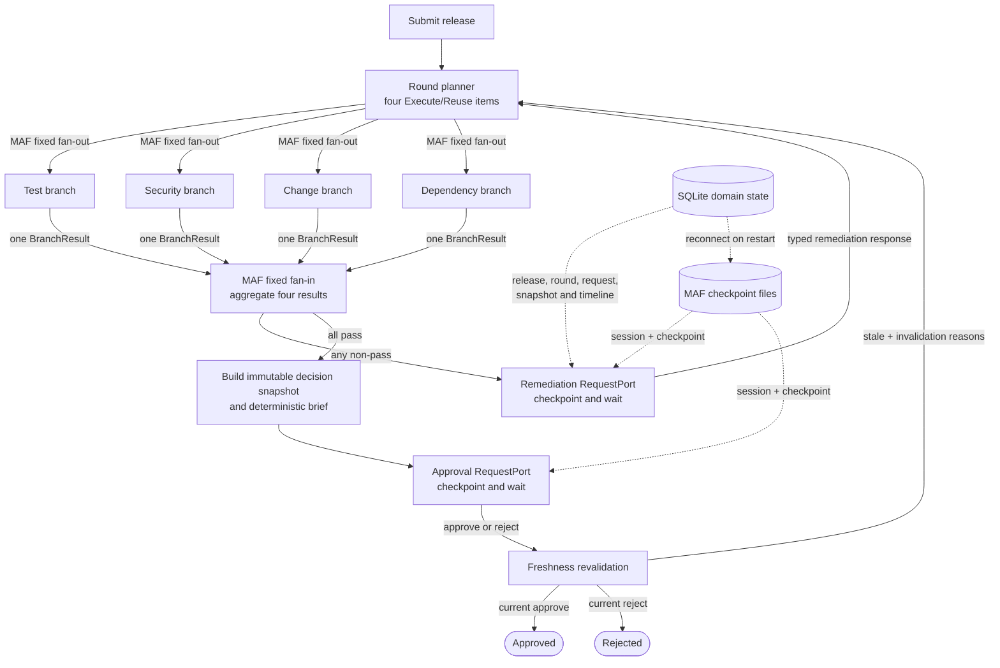

# Release Readiness Coordinator — Implementation Plan

## Decision Summary

- Build one deployable ASP.NET Core .NET 10 application with server-rendered Razor Pages, a small domain/workflow layer, EF Core with SQLite, and no separate services or client application.
- Pin `Microsoft.Agents.AI.Workflows` to `1.17.0`. Build one fixed MAF graph: round planner → four-way fan-out → fixed fan-in aggregator → remediation or approval external call → next round or terminal decision.
- Use four work items on every round. Each is `Execute` or `Reuse`; therefore every fixed fan-in source always emits exactly one `BranchResult`, while a reused branch performs no provider, policy, or LLM work.
- Represent remediation and approval with typed MAF external calls/`RequestPort`s. A request is raised only after fan-in and resumes through its correlated `ExternalResponse`.
- Keep business records in SQLite and MAF checkpoints in the framework's process-exclusive `FileSystemJsonCheckpointStore`. Store only their correlation identifiers together.
- Make all readiness, retry, reuse, aggregation, freshness, and final-decision authority deterministic C#. The sole LLM capability analyses rollback-plan text into cited checklist findings.
- Deliver six runnable vertical slices, establishing a MAF-orchestrated happy path first and adding failure/wait, selective reuse, restart durability, the real analyser, and stale-safe approval in that order.

## Repository Baseline and MAF Verification

The repository currently contains only `PROJECT_RULES.md`, a one-line `README.md`, and `.gitignore`. There is no solution, application, test project, package reference, lock file, or pinned MAF version. The planning prompt's “pinned version” assumption is therefore false; there is no conflicting implementation to preserve. The smallest correction is to pin an exact version in the first slice and commit package restore metadata.

This plan selects `Microsoft.Agents.AI.Workflows` **1.17.0**, the current stable .NET release verified on 2026-08-10 from the [official release](https://github.com/microsoft/agent-framework/releases/tag/dotnet-1.17.0) and [NuGet package](https://www.nuget.org/packages/Microsoft.Agents.AI.Workflows/1.17.0). If implementation changes that pin, the following checks must be repeated before coding the workflow.

Version-matched findings:

- `WorkflowBuilder.AddFanOutEdge(...)` and `AddFanInBarrierEdge(sources, target)` represent the four-check split and aggregation. MAF runs triggered executors in a superstep in parallel and checkpoints at superstep boundaries; this is actual graph orchestration, not an application-service loop. See the [workflow execution model](https://learn.microsoft.com/en-us/agent-framework/workflows/workflows) and [1.17.0 builder source](https://github.com/microsoft/agent-framework/blob/dotnet-1.17.0/dotnet/src/Microsoft.Agents.AI.Workflows/WorkflowBuilder.cs).
- A fan-in barrier buffers until **every declared source** has emitted at least one message. It does not safely complete when conditional routing activates only a subset. This is explicit in the [fan-in API contract](https://learn.microsoft.com/en-us/dotnet/api/microsoft.agents.ai.workflows.workflowbuilder.addfaninbarrieredge?view=agent-framework-dotnet-latest) and 1.17.0 fan-in state source. Conditional four-source activation is rejected for this MVP.
- The safer selective-rerun design is a fixed four-branch round. The planner sends each branch an `Execute` or `Reuse` item; each source emits one result, so the barrier is deterministic and a complete round is inherent.
- `AddExternalCall<TRequest,TResponse>` adds a typed bidirectional request port. It emits `RequestInfoEvent`; the host later sends `request.CreateResponse(...)` through `SendResponseAsync`. Pending requests are included in checkpoints and re-emitted after restore. See [human-in-the-loop requests](https://learn.microsoft.com/en-us/agent-framework/workflows/human-in-the-loop) and the [external-call API](https://learn.microsoft.com/en-us/dotnet/api/microsoft.agents.ai.workflows.workflowbuilderextensions.addexternalcall?view=agent-framework-dotnet-latest).
- In 1.17.0, `FileSystemJsonCheckpointStore` is a public, lightweight, process-exclusive store. `CheckpointManager.CreateJson(store)` externalizes checkpoints, `GetLatestCheckpointAsync(sessionId)` finds the head, and `InProcessExecution.ResumeStreamingAsync(workflow, checkpoint, manager)` rehydrates a new run. The graph and executor IDs must be identical. See the [store source](https://github.com/microsoft/agent-framework/blob/dotnet-1.17.0/dotnet/src/Microsoft.Agents.AI.Workflows/Checkpointing/FileSystemJsonCheckpointStore.cs) and [rehydration sample](https://github.com/microsoft/agent-framework/blob/dotnet-1.17.0/dotnet/samples/03-workflows/Checkpoint/CheckpointAndRehydrate/Program.cs).

Official documentation and tagged source answered the required behavior; no executable spike was needed. Temporary package/source inspection data was removed.

## MVP Architecture and Workflow

The single web process owns HTTP endpoints, Razor Pages, the MAF in-process run host, deterministic policies, one rollback analyser adapter, simulated evidence providers, SQLite access, and the file checkpoint store. A request starts or resumes a workflow synchronously until it reaches another external request or a terminal result. There is no background worker, queue, scheduler, broker, or real-time channel.



`RoundPlannerExecutor`, four branch executors, `RoundAggregatorExecutor`, remediation and approval gate executors, `FreshnessExecutor`, and terminal executors are nodes in one static MAF workflow. Typed edges route aggregate outcomes and external responses; the edges from remediation and stale freshness back to the planner form the evaluation-round loop. Branches always return promptly and never own a wait.

## Core Domain Contracts and Persistence

Keep these small contracts; use separate concepts rather than one universal status enum:

- `ReleaseSubmission`: unique release ID/revision, service, version, requested deployment window, rollback-plan text, and initial evidence references. A duplicate ID/revision returns a conflict. Approved or rejected revisions cannot reopen.
- `EvidenceRecord`: evidence ID, check kind, typed payload, release version, observed/received times, immutable content hash, and source simulation controls. New remediation creates a new record/version rather than mutating history.
- `BranchWorkItem`: release and round IDs, check kind, `Execute|Reuse`, candidate prior result, current evidence/release fingerprints, policy/analyser versions, and human-readable reason codes.
- `BranchResult`: `Passed|Blocked|MissingEvidence|TransientFailure`; `Executed|Reused`; findings; evidence and relevant-input fingerprints; policy/analyser versions; evaluated time and `ValidUntil`; attempt count; and, for reuse, source result and source round IDs.
- `EvaluationRound`: round number, four work items/results, aggregate outcome, start/completion times, and trigger (`Submission|Remediation|StaleApproval`). Completeness is exactly one result per check kind.
- `RemediationRequest`/`RemediationSubmission`: request ID, blocking result IDs/reasons, changed evidence or release inputs, explicit branch invalidations, actor, and time.
- `DecisionSnapshot`: immutable ID, passing round ID, four resolved source-result IDs and hashes, relevant release/evidence fingerprints, policy/analyser versions, expiry bound, deterministic brief and brief hash.
- `HumanResponse`: request and snapshot IDs, `Approve|Reject`, actor, comment, submitted time, and client concurrency token. A separate validation result records accepted or stale.
- Process phase is only `Evaluating`, `WaitingForRemediation`, `WaitingForApproval`, `Approved`, `Rejected`, or `Failed`. Result validity is computed as current/expired/invalidated with reason codes; it is not conflated with phase, branch outcome, or execution disposition.

SQLite owns releases, typed evidence payloads, rounds, branch results, rollback analyses, remediation, decision snapshots/responses, workflow correlation, and an append-only display timeline. EF Core is used directly through a bounded application data service; no generic repository, CQRS layer, or event store is introduced. Unique keys on release revision, round/check, request response, and timeline operation make replayed executor writes harmless.

MAF checkpoint files remain under a dedicated application-data directory outside the SQLite database. One application-lifetime store and a simple in-process semaphore serialize workflow start/resume access because the built-in file store is not thread-safe; this is a critical section, not a queue or worker. A small workflow-correlation row links release revision, stable MAF session ID, last observed checkpoint ID, pending request ID/type, and phase. It does not copy MAF state into business tables. Checkpoint and SQLite writes cannot be atomic; restart reconciliation uses the checkpoint store as workflow-continuation truth and idempotent SQLite operations as business-history truth.

## Readiness Checks

Fixed policy constants are code-owned and versioned: Test/Security/Dependency evidence is current for 24 hours; Test pass rate is at least 95%; release version must match exactly. Changing a constant increments that branch's policy version.

| Branch | Evidence and minimal deterministic policy | Result mapping | Known transient behavior | Invalidation inputs |
|---|---|---|---|---|
| Test | Test run version, completion time, pass rate, critical-suite failures. Pass when version matches, rate ≥95%, no critical suite failed, and evidence is <24h old. | No record/required field → `MissingEvidence`; policy miss → `Blocked`; otherwise `Passed`. | Simulated source unavailability is retried, then `TransientFailure`. | Test evidence/hash/expiry, release version, Test policy version, explicit Test invalidation. |
| Security | Scan version/time, unresolved critical count, high findings, and approved exceptions with expiry/scope. Pass when versions match, no critical remains, every high has a matching exception valid through the release window, and scan is <24h old. | Missing scan/exception details → `MissingEvidence`; uncovered finding → `Blocked`; otherwise `Passed`. | Same bounded source rule. | Security evidence/hash/expiry, release version/window, Security policy version, explicit Security invalidation. |
| Change | Change approval and approved window plus rollback-plan analysis. Pass when approved, requested deployment is wholly inside the approved window, and all five rollback findings satisfy deterministic policy. | Missing approval or rollback text → `MissingEvidence`; unapproved/out-of-window/absent-or-ambiguous checklist item → `Blocked`; exhausted analyser/source transient → `TransientFailure`; else `Passed`. | Known change-source or analyser transient errors only are retried. | Change evidence, release window, rollback text hash, Change policy version, analyser version, explicit Change invalidation. |
| Dependency | Required/available versions, availability interval, maintenance intervals, observation time. Pass when versions are compatible, each dependency covers the release window, no maintenance overlaps it, and evidence is <24h old. | Missing dependency facts → `MissingEvidence`; incompatibility/unavailability/conflict → `Blocked`; otherwise `Passed`. | Same bounded source rule. | Dependency evidence/hash/expiry, release version/window and dependency requirements, Dependency policy version, explicit Dependency invalidation. |

Providers read local JSON/SQLite simulation records only. A reuse work item never calls them.

`ValidUntil` is deterministic: Test uses run time +24h; Security uses the earliest of scan time +24h and applicable exception expiry; Change uses the approved-window end; Dependency uses the earliest of observation +24h and asserted availability end. A result whose bound has passed cannot be reused or approved.

## Rollback-Plan Analysis Boundary

`RollbackPlanAnalyser` is the only LLM-backed capability. It receives only rollback-plan text and an analyser version and returns structured findings for exactly:

1. application rollback;
2. database rollback;
3. configuration rollback;
4. verification steps;
5. rollback decision owner.

Each finding contains `Present|Absent|Ambiguous`, a concise normalized observation, and zero or more citations with short exact excerpts plus character offsets into the submitted text. The prompt/schema instruct the model to abstain with `Absent` or `Ambiguous` when support is missing or unclear and never synthesize steps. Strict JSON-schema validation rejects unknown items, unsupported citations, or excerpts that do not match the input.

Deterministic Change policy requires all five findings to be `Present`; the LLM never emits `Passed`, chooses routing, creates the decision brief, or decides the release. Valid findings are cached by normalized content SHA-256 plus `AnalyzerVersion`, where that version identifies prompt, schema, model/deployment family, and parsing rules. A content or version change invalidates the cache. An executing Change branch may use a valid analysis cache, but a reused Change branch does not call even the cache-facing analyser path.

Known model timeout/throttling or invalid structured output gets the same small immediate retry allowance. Exhaustion yields Change `TransientFailure` with no fabricated findings and is not cached. Missing/ambiguous content is a successful analysis followed by deterministic `Blocked`; unexpected serialization/programming defects fail the workflow technically. Curate 10 cases spanning complete plans, each missing item, ambiguous ownership, misleading headings, contradictory steps, and citation fidelity; score item classification, abstention, citation validity, and the deterministic Change mapping.

## Selective Rerun, Reuse, and Invalidation

The planner reads current SQLite evidence metadata; this is not an evidence-provider call. It resolves the latest branch result, following a reused result's source link, and emits four work items:

```text
for check in Test, Security, Change, Dependency:
    prior = latestRound.result(check)
    reasons = explicitInvalidations(check)
    reasons += changedMappedEvidenceOrReleaseInputs(check, prior.fingerprints)
    reasons += expired(prior.validUntil, clock.now)
    reasons += versionMismatch(prior.policyVersion, currentPolicyVersion(check))
    if check == Change:
        reasons += analyzerVersionMismatch(prior.analyzerVersion, currentAnalyzerVersion)

    reusable = prior exists
        and prior.outcome == Passed
        and reasons is empty

    emit BranchWorkItem(check, reusable ? Reuse : Execute, reasons)
```

An `Execute` branch calls its provider, applies immediate retry if applicable, evaluates policy, and persists a new result. A `Reuse` branch verifies the planner's supplied hashes/versions defensively, then copies the prior outcome and validity metadata into a new round result with `ReusedFromResultId/RoundId`; it does not call a provider, evaluator, or LLM. The barrier combines these four newly emitted result envelopes into one complete round.

The explicit invalidation map is deliberately small:

| Changed input | Invalidated checks |
|---|---|
| Release version | Test, Security, Change, Dependency |
| Requested deployment window | Security, Change, Dependency |
| Test/Security/Change/Dependency evidence | Matching branch only |
| Dependency requirements | Dependency |
| Rollback-plan text or analyser version | Change |
| Branch policy version | Matching branch only |
| Coordinator's explicit branch selection | Selected branches |
| Clock reaches a result's `ValidUntil` | That result's branch |

Every timeline entry says `Executed because …` or `Reused from round N because evidence, inputs, time, and versions remained valid`. The round view shows the same disposition and source link.

## Retry, Wait, Restart, and Approval Behaviour

- Retry only typed, known transient provider/analyser failures: one initial attempt plus two immediate retries, with no delay. Missing data and policy blockers are not retried. Exhaustion returns `TransientFailure` with attempt details. Any unclassified exception, corrupted checkpoint, invariant violation, or unrecoverable SQLite error emits a MAF failure and sets process phase `Failed`; it is never translated to a branch business result.
- Aggregation always receives four results before choosing. Any `Blocked`, `MissingEvidence`, or `TransientFailure` creates one post-fan-in remediation request containing all problems. The remediation `RequestPort` checkpoints and returns control to the web host.
- On each `RequestInfoEvent`, persist request ID/type and display payload. On each `SuperStepCompletedEvent`, persist the checkpoint reference. An external POST stages one correlated response, reconstructs the identical graph with stable executor IDs, opens `FileSystemJsonCheckpointStore`, obtains the recorded/latest valid checkpoint, calls `ResumeStreamingAsync`, captures the re-emitted request, verifies its ID/type, and sends `request.CreateResponse(...)`. The run continues to the planner or freshness executor.
- On application startup no worker resumes runs. A release detail or response request performs reconciliation. If the checkpoint is newer than the recorded pointer, adopt it and replay idempotent business writes; if SQLite says a request is pending, restoration must re-emit the same request. Missing/corrupt/incompatible state is a visible technical failure, not a fresh workflow.
- When all four pass, persist an immutable `DecisionSnapshot` and deterministic brief, then request a human decision. The form posts the snapshot ID, request ID, and concurrency token.
- Before accepting either approval or rejection, `FreshnessExecutor` checks phase/request correlation; that the snapshot is the latest fully passing round; current evidence and release fingerprints; policy/analyser versions; all validity deadlines; and brief hash. If stale, record the declined response attempt and reasons, invalidate only affected checks, and loop to a selective evaluation. Do not accept the old response automatically after reevaluation.
- A current approval or rejection is persisted once and is terminal for that release revision.

## Minimum UI

Use Razor Pages and normal POST/redirect/GET; no SPA state store, SignalR, or design-system work.

- **Submit release:** release metadata, deployment window, rollback text, and compact forms or demo fixtures for four simulated evidence records; duplicate ID/revision feedback.
- **Release detail/workflow:** current phase, four latest results, findings/evidence, a round-by-round table with `Executed`/`Reused` and reasons/source round, remediation/approval wait cards, deterministic brief, and chronological timeline. Manual refresh is sufficient.
- **Remediation form:** shown only for the active request; edit affected evidence/release fields, choose explicit invalidations, and submit the request correlation token.
- **Decision form:** shown only for the active approval request; display the immutable brief/snapshot and Approve/Reject controls with actor/comment. Stale responses return to the detail page with revalidation reasons and the new evaluation round.

## Vertical Implementation Slices

### Slice 1 — Runnable MAF happy path

- **Outcome:** submit a fixture release, watch MAF fan out to four branches, aggregate, issue an approval request, and approve to terminal state.
- **Included:** .NET 10 solution; one Razor Pages app; exact MAF 1.17.0 pin; minimal SQLite release/round/result/timeline state; static graph and stable executor IDs; in-memory checkpoint manager; simple passing providers/policies; test-only fixed rollback findings; basic submit/detail/decision pages.
- **Components:** app host, domain contracts, MAF executors/topology, EF Core SQLite, Razor Pages.
- **Verification:** one integration scenario asserts four branch invocations, one fan-in result, post-aggregation approval request, and terminal approval; UI smoke submits and approves.
- **Deferred:** non-pass outcomes, remediation, reuse, restart durability, live LLM, stale approval hardening.

### Slice 2 — Deterministic checks, retry, and remediation wait

- **Outcome:** all four shallow policies expose expected branch outcomes; multiple problems aggregate into one remediation wait.
- **Included:** typed evidence; fixed policy versions/TTLs; injectable clock; known transient simulation and 1+2 immediate attempts; `Blocked`, `MissingEvidence`, and exhausted `TransientFailure`; remediation external call and loop back to a new all-execute round.
- **Components:** providers, policy evaluators, branch executors, aggregator, remediation pages/timeline.
- **Verification:** data-driven policy cases plus scenarios for multiple blockers and missing/transient evidence; assert no branch waits and unexpected errors fail technically.
- **Deferred:** selective reuse, cross-process recovery, live LLM, approval staleness.

### Slice 3 — Selective rerun and explainable reuse

- **Outcome:** remediation changes one or more inputs and the next round executes only affected/invalid branches while still aggregating four results.
- **Included:** fingerprints, validity deadlines, version stamps, explicit invalidation map, `Execute|Reuse` planner, reuse source links, defensive reuse checks, round/timeline explanations.
- **Components:** planner, result persistence, branch handlers, round UI.
- **Verification:** data-driven reuse decisions and a multi-blocker remediation scenario proving providers/policies/analyser are not called for reused branches.
- **Deferred:** process restart, real model calls, response freshness race handling.

### Slice 4 — Durable waits and restart recovery

- **Outcome:** stop the app at remediation or approval, restart, open the release, and safely continue the same MAF session.
- **Included:** `FileSystemJsonCheckpointStore`, `CheckpointManager.CreateJson`, checkpoint correlation, `ResumeStreamingAsync`, request re-emission/correlation, stable IDs, idempotent replay keys, reconciliation diagnostics.
- **Components:** workflow run host, checkpoint directory, SQLite correlation state, wait endpoints.
- **Verification:** process-level restart scenario checks no duplicate round/result/timeline records and continuation from both wait types (one may be the principal automated case, the other a focused integration variant).
- **Deferred:** distributed/multi-process hosting, custom store, workers, queues, timers.

### Slice 5 — Bounded rollback-plan analyser

- **Outcome:** Change readiness uses one real structured LLM analysis while deterministic C# retains authority.
- **Included:** one `IChatClient`-backed analyser, strict five-item schema, citation validation, abstention, content/version cache, bounded transient/invalid-output handling, configuration through environment/user secrets, deterministic fake for automated tests.
- **Components:** analyser adapter, rollback-analysis persistence, Change executor/policy, findings UI, curated dataset runner.
- **Verification:** 10-case dataset, cache/invalidation tests, unavailable/invalid output behavior, and an optional credentialed smoke call excluded from normal CI.
- **Deferred:** metadata extraction, agents/handoffs, extra prompts, LLM summaries or decisions.

### Slice 6 — Approval integrity and demonstration finish

- **Outcome:** human decisions bind to a current passing snapshot; expiry/change while waiting causes only affected checks to rerun; rejection terminates.
- **Included:** immutable snapshot/brief hash, response concurrency token, full freshness revalidation, stale-attempt audit, selective loop, terminal rejection, polished minimum workflow display and demo fixtures.
- **Components:** snapshot builder, freshness/terminal executors, decision endpoints/pages, timeline.
- **Verification:** stale evidence during approval, current rejection, full scenario suite, and principal UI smoke path.
- **Deferred:** authentication/roles beyond actor entry, reopening/cancellation, notifications, analytics, deployment execution.

## Verification and Evaluation Strategy

Coverage follows policy/orchestration risk, not a test-count target:

- Data-driven unit tests cover each deterministic check around thresholds, version/window matching, exception validity, maintenance overlap, freshness boundaries, and all result mappings. Separate data-driven cases cover reuse across evidence/input/time/policy/analyser/explicit invalidation changes.
- Approximately six workflow-level scenarios use the real fixed MAF graph and deterministic providers/clock:
  1. all checks pass and a current human approval terminates Approved;
  2. multiple checks block, remediation changes their inputs, only affected checks execute, and others reuse without calls;
  3. missing evidence or exhausted known transient failure aggregates, waits after fan-in, and resumes;
  4. the process restarts while waiting, restores checkpoint/domain correlation, re-emits the request, and resumes once;
  5. evidence expires while awaiting approval, the response is declined as stale, and only affected checks rerun;
  6. a current human rejection terminates Rejected.
- The 10-case rollback dataset evaluates item classification, abstention, exact citation grounding, schema validity, deterministic Change mapping, and cache keys. Normal tests use recorded structured responses; one manually enabled provider smoke test proves integration without making CI nondeterministic.
- Minimal browser smoke coverage proves submit → rounds/results → approval, and blocker → remediation → selective rerun. Detailed policy permutations stay below the UI layer.
- Do not test DTO properties, constructors, obvious EF mappings, framework DI wiring, or redundant permutations already represented in data-driven cases.

## Risks, Assumptions, and Genuine Open Decisions

- **MAF API stability:** 1.17.0 is now an explicit architectural pin. Package upgrades require rerunning fan-in, external-request, checkpoint rehydration, and stable-ID tests before adoption.
- **Two-store crash window:** filesystem checkpoints and SQLite cannot share a transaction. Stable operation keys, latest-checkpoint reconciliation, and replay tests bound this risk without inventing a durability layer.
- **Single-process checkpoint store:** `FileSystemJsonCheckpointStore` takes an exclusive lock. This is intentional for one deployable demo instance; scaling out is out of scope.
- **LLM deployment:** endpoint/model credentials are deployment configuration. Any `IChatClient` provider capable of strict structured output is acceptable; the analyser version includes provider/model identity, so choosing the available owner-supplied deployment does not alter architecture or policy authority.
- **Demo identity:** actor names are entered, not authenticated. This demonstrates decision integrity and staleness, not access control.
- **Simulated evidence:** local records are authoritative for the MVP. Their hashes let the planner detect changes without contacting a provider on reuse.
- No material project-rule conflict remains unresolved; absence of a repository MAF pin is corrected explicitly in Slice 1.

## PROJECT_RULES Compliance Review

| Rule area | Status | Plan evidence |
|---|---|---|
| One bounded .NET app; no platform expansion | Compliant | One Razor Pages process, SQLite, local providers; no broker, worker, scheduler, distributed service, generic engine, or extra document. |
| MAF performs real fixed orchestration | Compliant | Static executor graph uses MAF fan-out, fixed fan-in, typed routing, external calls, checkpoints, and loop edges. |
| Four readiness branches; wait only after fan-in | Compliant | Every branch emits one expected result; aggregator alone routes to remediation/approval waits. |
| Expected outcomes vs technical failures | Compliant | Four branch outcomes are explicit; unknown exceptions/corruption/persistence faults fail the workflow. |
| Selective execution and safe reuse | Compliant | Four `Execute|Reuse` work items, full validity/version/hash checks, source links, and no provider/policy/LLM calls on reuse. |
| Exactly one bounded LLM capability | Compliant | Only rollback checklist analysis uses an LLM; deterministic Change and release decisions retain authority. |
| SQLite business state plus lightweight MAF checkpoints | Compliant | Separate SQLite domain records and MAF `FileSystemJsonCheckpointStore`, correlated by stable IDs. |
| Restart and pending-request recovery | Compliant | `ResumeStreamingAsync`, identical topology/IDs, latest checkpoint reconciliation, and request re-emission are planned and tested. |
| Stale-safe human decision | Compliant | Immutable snapshot, full response-time freshness validation, selective reevaluation, and terminal current decisions. |
| Minimal UI and proportional verification | Compliant | Four server-rendered interactions, six risk-based workflow scenarios, data-driven policies, 10-case LLM dataset, minimal browser smoke tests. |
