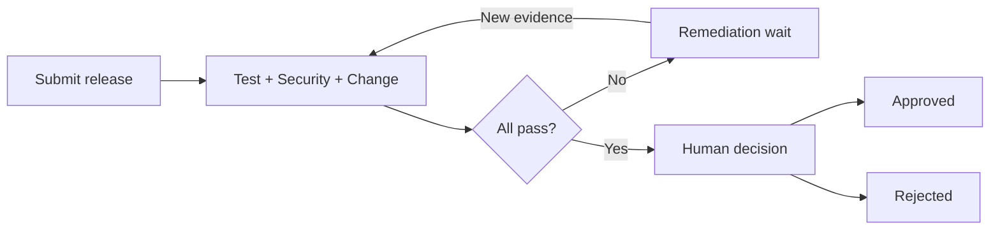
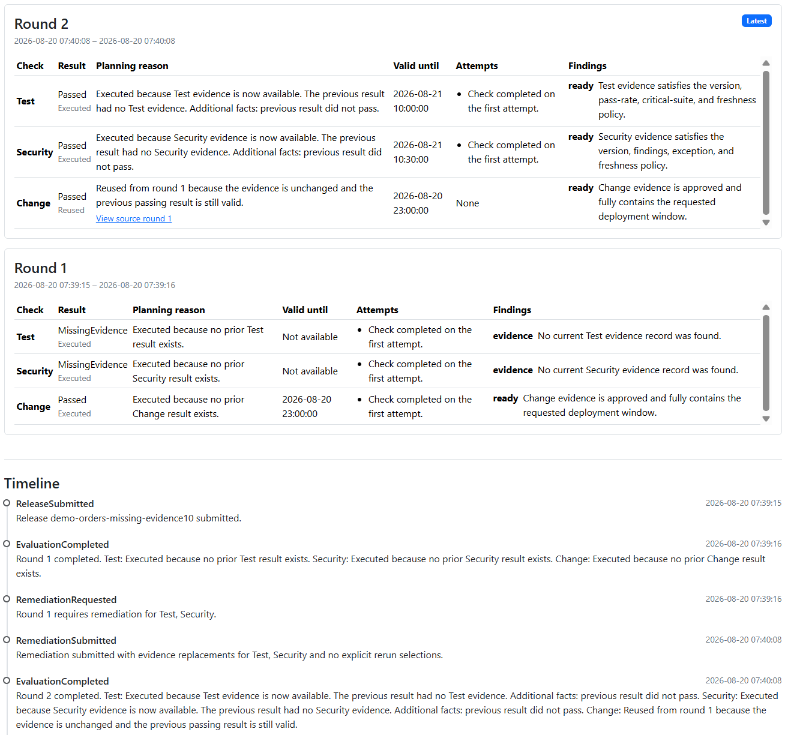
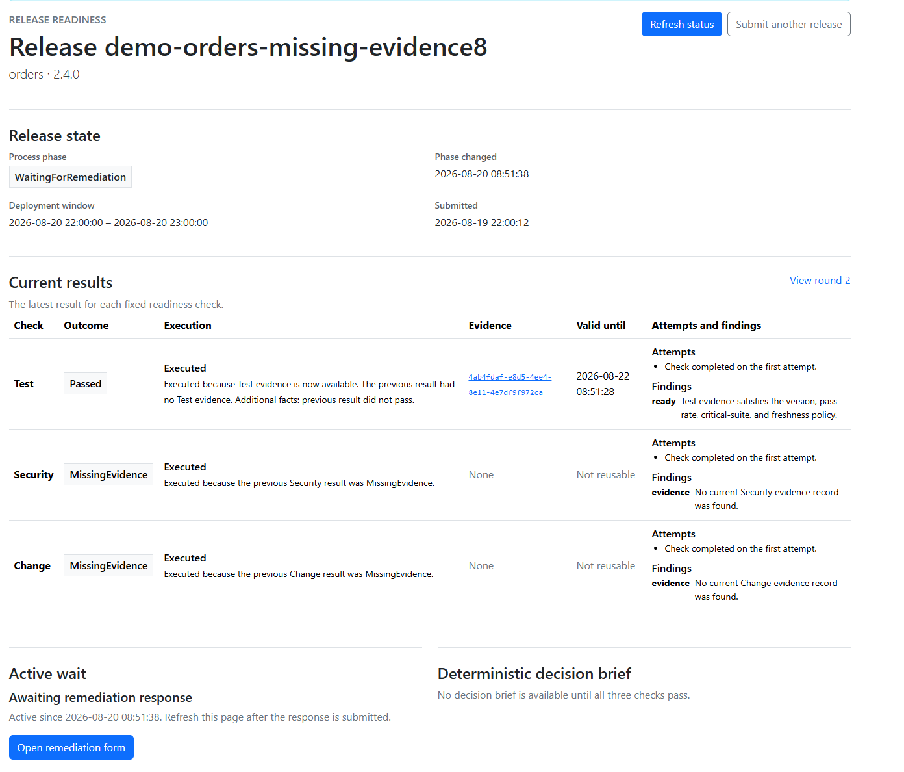
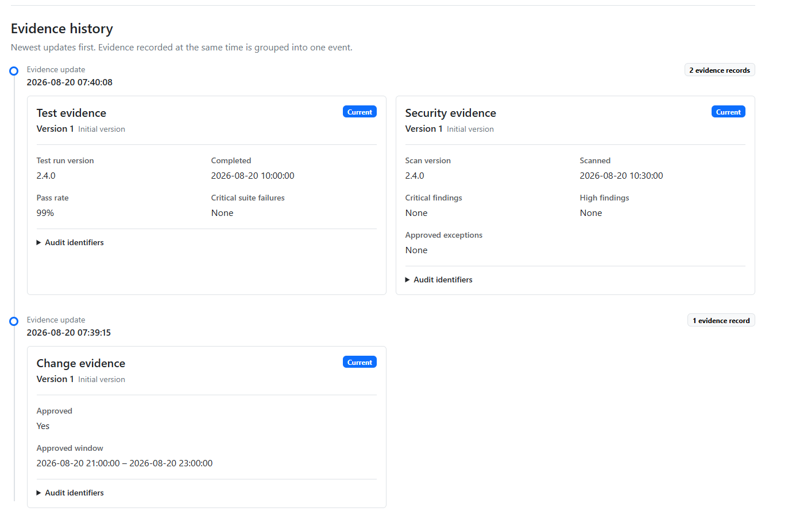

# Release Readiness Coordinator

A durable, human-in-the-loop release governance workflow built with .NET 10 and Microsoft Agent Framework.

Release Readiness Coordinator gathers simulated Test, Security, and Change evidence, evaluates the three checks in parallel, and waits for remediation when something blocks a release. On the next round, it runs only the checks affected by new evidence and safely reuses results that are still valid. Once every check passes, a release manager can approve or reject an immutable decision snapshot.

The result is a focused portfolio project that makes workflow orchestration, selective execution, recovery, and audit history visible in one server-rendered application.

## What this project demonstrates

- Real Microsoft Agent Framework fan-out and complete fan-in across three readiness checks.
- Deterministic release policies with explicit `Passed`, `Blocked`, `MissingEvidence`, and `TransientFailure` outcomes.
- Evidence-only remediation and selective reruns instead of reevaluating everything.
- Durable human waits that survive an application restart.
- Immutable evidence, evaluation rounds, decision snapshots, and an explainable audit timeline.
- Safe correlation between MAF checkpoint state and SQLite business records.



## Selective execution in action

Here, Test and Security run again after receiving evidence, while the still-current Change result is reused from round 1. Each result explains its planning reason and links reused work to its source round.



<details>
<summary><strong>More screenshots</strong></summary>

### Current readiness results and active remediation wait



### Immutable, versioned evidence history



</details>

## Try it locally

You need the .NET 10 SDK. No database server, queue, cloud account, or other infrastructure is required.

```text
dotnet restore
dotnet run --project src/ReleaseReadinessCoordinator/ReleaseReadinessCoordinator.csproj --launch-profile http
```

Open [http://localhost:5247](http://localhost:5247), load one of the built-in fixtures, give the release a unique ID, and submit it. The **Complete evidence** fixture takes the shortest path to a human decision; edit its Test and Security facts to demonstrate selective reuse. **No initial evidence** demonstrates complete fan-in before remediation.

For isolated data, detailed walkthroughs, restart recovery, and test commands, see the [technical guide](docs/technical-guide.md).

## Project scope

This is intentionally one bounded ASP.NET Core Razor Pages application. It simulates evidence produced by external systems; it does not run tests or scans, integrate with change-management services, execute deployments, or provide production authentication. Interactions use normal server-rendered requests and manual refresh so the workflow behavior remains easy to inspect.

## Documentation

- [Technical guide](docs/technical-guide.md) — setup, demo journeys, recovery, persistence, architecture, and commands
- [Architecture](docs/architecture.md) — code structure, workflow topology, persistence model, and continuation lifecycle
- [Project specification](SPEC.md) — authoritative requirements and design boundaries
- [Acceptance matrix](docs/acceptance-matrix.md) — the 13 MVP criteria mapped to automated and manual evidence
- [Architecture decisions](docs/decisions/) — checkpointing and domain-data authority decisions

## Technology

.NET 10 · ASP.NET Core Razor Pages · Microsoft Agent Framework 1.17.0 · Entity Framework Core · SQLite · xUnit
