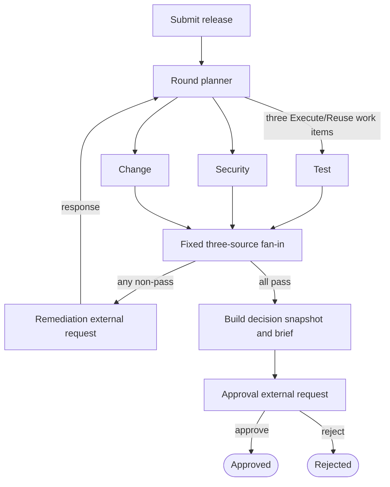

# Spec: Release Readiness Coordinator

**Status:** Approved input for implementation planning  
**Document role:** Sole authoritative project specification  
**Last updated:** 2026-08-20

## 1. Authority and change control

Apply project information in this order:

1. An explicit instruction from the project owner for the current task.
2. This specification.
3. The approved files under `tasks/`.
4. Existing code, tests, configuration, and other documentation.

This specification defines the product scope, required behavior, settled architecture, engineering boundaries, and success criteria. Planning artifacts may explain how to implement it, but they must not weaken, reinterpret, or override it.

Do not modify this file silently. A material deviation must be identified, justified, and approved by the project owner before implementation.

## 2. Objective and portfolio signal

Release Readiness Coordinator is a bounded .NET portfolio MVP demonstrating Microsoft Agent Framework workflow orchestration through a realistic enterprise release-governance process.

The system coordinates readiness evidence produced by simulated external systems before a production release. It does not run tests, perform security scans, manage change systems, execute deployments, or replace CI/CD.

The MVP must visibly demonstrate:

- three independent readiness checks executed as one parallel evaluation round;
- fan-out and complete fan-in aggregation;
- expected branch-local blockers, missing evidence, and transient failures;
- durable waits for external remediation and human approval;
- selective re-execution of affected checks;
- safe reuse of successful and still-current results;
- checkpoint-based recovery after application restart;
- correlated continuation of typed external requests;
- deterministic readiness policies and routing.

The target is one understandable workflow, not a miniature release-management platform.

## 3. Actors

### Release coordinator

Can:

- submit a release candidate and initial evidence;
- inspect workflow, evidence, findings, and evaluation history;
- supply new versions of branch evidence;
- explicitly select checks for rerun when submitting remediation.

### Release manager

Can:

- inspect the latest fully passing evaluation snapshot and deterministic decision brief;
- approve or reject the release;
- provide an actor name and decision comment.

The MVP does not require production-grade identity or authorization. Actor names may be entered manually.

## 4. Primary end-to-end journey

1. A release coordinator submits one release candidate.
2. Test, Security, and Change checks run as one evaluation round.
3. Each branch promptly returns one structured result.
4. The workflow forms a complete three-branch result view.
5. When any branch blocks, lacks evidence, or exhausts a known transient retry, the workflow creates one remediation request after fan-in and pauses.
6. The coordinator supplies new versions of affected branch evidence.
7. A new evaluation round executes only branches that are unsuccessful, use an evidence record that is no longer current, are expired, or are explicitly selected.
8. Successful branch results whose evidence identity and deadline still match are reused without recomputation.
9. When all three branches pass, the workflow creates an immutable decision snapshot and deterministic decision brief, locks evidence changes for that release, and pauses for a human decision.
10. The application restores and verifies the active typed MAF approval request before sending the human response into the workflow.
11. A response delivered through that request approves or rejects the immutable snapshot and is persisted once as a terminal decision.
12. Mismatched, missing, corrupt, or incompatible continuation state is rejected before workflow resumption and creates no human-decision business record.
13. A workflow waiting for remediation or approval can be restored after the application is stopped and restarted.

The UI and timeline must make every evaluation round understandable, especially which checks were **Executed** and which were **Reused**.

## 5. Release submission

A release submission contains:

- globally unique release identifier;
- service name;
- release version;
- requested deployment window;
- initial Test, Security, and Change evidence or references to local simulated evidence.

Service name, release version, and requested deployment window are immutable after submission. Remediation cannot edit them. Correcting any of these values requires a separate release submission with a new release identifier.

Duplicate release identifiers return a conflict. Approved and rejected releases are terminal and cannot be reopened. The MVP has no numeric release revision, release-family grouping, supersession link, evidence/history migration between releases, withdrawal, or cancellation.

## 6. Workflow semantics

### 6.1 Expected branch outcomes

Each readiness branch finishes promptly with exactly one expected outcome:

- `Passed`;
- `Blocked`;
- `MissingEvidence`;
- `TransientFailure`.

A readiness branch must never wait for a person or remain alive while evidence is corrected. Waiting is owned by the post-fan-in workflow.

Expected missing evidence, deterministic policy blockers, and exhausted known transient integration failures are domain outcomes. Unexpected programming errors, corrupted state, invariant violations, and unrecoverable persistence failures remain technical workflow failures.

### 6.2 Separate state dimensions

Do not create one universal status enum. Keep these concepts separate:

- process phase: `Evaluating`, `WaitingForRemediation`, `WaitingForApproval`, `Approved`, `Rejected`, or `Failed`;
- branch outcome: `Passed`, `Blocked`, `MissingEvidence`, or `TransientFailure`;
- execution disposition: `Executed` or `Reused`;
- planning reason: `InitialEvaluation`, `PreviousResultNotPassed`, `EvidenceChanged`, `Expired`, `ExplicitlySelected`, or `StillCurrent`.

A historical `BranchResult` is immutable and is never mutated into an invalidated state. It records the exact evidence record used. A passing result also records an externally calculated `ValidUntil` deadline; non-passing results need no deadline because they are never reusable. The round planner decides whether that result is reusable in the current context.

### 6.3 Aggregation

Every evaluation round must produce one result for each of Test, Security, and Change.

The aggregator receives all three results before routing:

- all three `Passed` → build decision snapshot and request human approval;
- any non-pass result → create one remediation request containing every current problem and wait for remediation.

## 7. Minimal deterministic readiness policies

All authoritative readiness decisions are deterministic C# decisions.

Fixed MVP policy constants:

- Test and Security evidence is current for 24 hours unless an earlier evidence-specific bound applies;
- a passing Change result is current until the end of its approved window;
- Test pass rate must be at least 95 percent;
- evidence release versions must match the submitted release version exactly;
- policy constants are code-owned.

| Branch | Required evidence and pass policy | Result mapping |
|---|---|---|
| Test | Test run version, completion time, pass rate, and critical-suite failures. Pass when version matches, pass rate is at least 95%, no critical suite failed, and evidence is current. | Missing record or required field → `MissingEvidence`; deterministic policy miss → `Blocked`; exhausted known source failure → `TransientFailure`; otherwise `Passed`. |
| Security | Scan version/time, unresolved critical findings, high findings, and approved exceptions with scope and expiry. Pass when version matches, no critical finding remains, every high finding has a matching exception valid through the release window, and evidence is current. | Missing scan or required exception facts → `MissingEvidence`; uncovered finding or invalid exception → `Blocked`; exhausted known source failure → `TransientFailure`; otherwise `Passed`. |
| Change | Change approval and approved window in one versioned Change evidence record. Pass when the change is approved and the requested deployment is wholly inside the approved window. | Missing approval or approved window → `MissingEvidence`; unapproved or out-of-window evidence → `Blocked`; exhausted known source failure → `TransientFailure`; otherwise `Passed`. |

Do not implement a configurable policy language, generic rules engine, or user-configurable governance platform.

## 8. Selective rerun and safe reuse

Selective rerun is the defining feature. Rerunning every branch after remediation does not satisfy the specification.

A previous branch result may be reused only when it:

- passed;
- has a `ValidUntil` later than the current time;
- references the evidence record that is still current for that branch;
- was not explicitly selected for rerun.

A branch must execute again for the corresponding planning reason when there is no prior result, the prior result did not pass, its evidence record is no longer current, its deadline was reached, or the coordinator explicitly selected it.

A reused branch must:

- perform no evidence-provider call;
- perform no policy-evaluator call;
- verify the supplied evidence identity and deadline defensively;
- emit a result for the new round linked to the source result and source round;
- explain why reuse was safe.

Each branch has zero or one current immutable/versioned evidence record. Initial submission may omit a branch record to exercise `MissingEvidence`. A response to the active remediation request may create or replace current evidence for one or more branches; doing so affects only those matching branches. A newly current record always counts as changed evidence even when its facts equal an older record. Evidence replacement is rejected in every other phase, including while approval is pending.

Release metadata does not participate in change detection because it is immutable after submission. Explicit branch selection and reaching a validity deadline affect the planner decision directly without changing evidence.

The bounded application data service must atomically persist a new evidence version, link it to the record it supersedes, and make it current. Do not compute input generations, content fingerprints, canonical payloads, or hashes for release, evidence, result, snapshot, or decision-brief change detection.

Every round and timeline entry must state `Executed because …` or `Reused from round N because …`. Persist the stable planning reason code and a concise human-readable detail; do not create a separate reason enum for each release field.

When more than one condition applies, choose one planning reason deterministically in this order: `InitialEvaluation`, `ExplicitlySelected`, `EvidenceChanged`, `PreviousResultNotPassed`, `Expired`, then `StillCurrent`. Human-readable detail may mention additional facts without creating additional domain reason codes.

## 9. Change readiness

Change evidence contains the approval state and approved deployment window. Change readiness passes when the change is approved and the requested deployment window is wholly inside the approved window.

Approval or window corrections create a new immutable Change evidence version. The current evidence identity and approved-window deadline participate in selective reuse like the equivalent inputs for the other readiness branches.

## 10. Human decision

When all three branches pass, persist an immutable `DecisionSnapshot` containing:

- the passing evaluation round;
- resolved source result IDs and evidence IDs for all three checks;
- the earliest validity bound;
- the deterministic decision brief as immutable snapshot content.

The approval `RequestPort` exposes only a typed reference to the durable human-decision request. SQLite remains the authority for the immutable snapshot and brief displayed to the manager. While that request is active, the release accepts no evidence replacement, remediation submission, or explicit rerun. This portfolio constraint makes the database snapshot a closed decision package without duplicating it into workflow-continuation state.

MAF continuation state is the authority for response correlation; SQLite is the authority for domain content. Before rendering or resuming, the application rebuilds the identical graph, restores the pending request, and exactly reconciles its workflow request ID, typed request/response contract, and durable domain request ID with the correlation and active request stored in SQLite. A missing, mismatched, corrupt, or incompatible request is rejected before any response enters the workflow and produces no human-response business record. Checkpoint storage must remain trusted private infrastructure because MAF restores complete runtime state before this application-level check. The application's checkpoint-carried wait payload supplies only correlation identity and never supplies domain content to the UI or business handlers.

The response contains the manager's `Approve` or `Reject` decision and audit fields. It does not submit a snapshot identity or a separate domain concurrency token; the reconciled durable request reference identifies the snapshot being answered. An exact replay is idempotent, while reuse of a response identity with different content is a technical conflict.

The decision brief is not regenerated or hashed when a response arrives. The handler does not compare current evidence IDs or revalidate result deadlines. A correctly resumed approval or rejection is persisted once and is terminal for that release.

Human decision never routes back to the planner. Selective reevaluation is demonstrated only by the remediation path.

## 11. Retry and failure behavior

Retry only typed, known transient evidence-provider failures.

Use one initial attempt plus two immediate retries per executing branch, with no delay. Do not retry missing evidence or deterministic policy blockers. Retry exhaustion returns `TransientFailure` with attempt details.

Do not add durable timers, retry workers, queues, schedulers, exponential-backoff infrastructure, or a general resilience platform.

Unclassified exceptions, corrupted checkpoints, impossible workflow invariants, and unrecoverable SQLite failures fail the workflow technically and make that failure visible.

## 12. Settled architecture

### 12.1 Application shape

Build one deployable ASP.NET Core .NET 10 application with:

- server-rendered Razor Pages and normal POST/redirect/GET interactions;
- one small domain/workflow layer in the same bounded solution;
- EF Core with SQLite for business and audit state;
- local in-process, JSON, or SQLite-backed simulated evidence providers;
- no separate client, service, worker, queue, scheduler, broker, event bus, or real-time channel.

An HTTP request starts or resumes a workflow and runs it until the next external request or terminal result. Do not introduce a startup worker that automatically resumes workflows.

### 12.2 Microsoft Agent Framework

Pin `Microsoft.Agents.AI.Workflows` to exact version `1.17.0` for the MVP.

MAF must perform the real orchestration. Do not hide the process in an application-service loop behind a decorative MAF wrapper.

Use one static graph with stable executor IDs:



The planner emits exactly three `BranchWorkItem`s each round, one per readiness check, with disposition `Execute` or `Reuse`. Every branch emits exactly one `BranchResult`, allowing a deterministic fixed three-source fan-in while still ensuring reused checks perform no real work.

Represent remediation and approval with typed MAF external calls/`RequestPort`s whose request payloads contain only the corresponding durable request ID. External requests occur only after fan-in. Pending requests must survive checkpoint restoration, reconcile exactly with SQLite, and resume through their correlated response.

Changing the MAF version requires source-driven reverification of fan-out/fan-in behavior, external-request restoration, checkpoint rehydration, and stable executor-ID compatibility before implementation continues.

### 12.3 Persistence and restart recovery

Use SQLite for:

- releases identified by one globally unique release identifier;
- immutable/versioned evidence;
- evaluation rounds and branch results;
- remediation requests and submissions;
- decision snapshots and human responses;
- workflow correlation metadata, including the active durable request ID;
- append-only display timeline entries.

Use MAF `FileSystemJsonCheckpointStore` in a dedicated application-data directory for workflow continuation. Keep MAF checkpoint data outside SQLite and store only stable correlation identifiers between the two stores.

SQLite supplies the workflow session ID used to select the latest checkpoint and the expected pending-wait tuple. MAF then restores its complete runtime state, including execution position, pending messages, and the external-request envelope. Only the application-defined request payload is restricted to the durable request reference; SQLite does not reconstruct MAF runner state.

The revision-bearing pre-release SQLite database and filesystem checkpoints are disposable when the single-identifier contract is implemented. Delete and recreate both stores; do not add dual-read compatibility, a backfill, or a production data migration for this MVP correction.

Use one application-lifetime checkpoint store and external synchronization around start/resume access because the store is process-exclusive and not thread-safe. This is a small critical section, not a queue or background execution architecture.

The checkpoint store is workflow-continuation truth; idempotent SQLite records are business-history and domain-content truth. Their writes are not atomic. Use stable operation keys and exact identity reconciliation to make replayed business writes harmless. A checkpoint may authorize continuation only when its typed wait identity equals the SQLite correlation tuple; it may never replace, repair, or override SQLite domain content.

On release-detail or response requests, reconstruct the identical graph with stable executor IDs, restore the latest valid checkpoint, verify the re-emitted workflow request ID, typed port contract, and durable request ID against SQLite, and only then render SQLite content or send the correlated response. This application deliberately uses the durable rehydration path for every HTTP continuation because it does not retain live `StreamingRun` instances between requests; MAF also supports responding directly through a retained live run, but that is not this application's lifecycle. Missing, corrupt, mismatched, or incompatible continuation state becomes a visible technical failure; never silently start a fresh workflow.

The MVP must demonstrate:

1. reach a remediation or approval wait;
2. stop the application;
3. restart it;
4. open the existing release;
5. restore the same workflow;
6. submit the pending response;
7. continue without duplicate business records.

### 12.4 Core domain concepts

The plan and implementation must preserve these concepts without turning them into a generic framework:

- `ReleaseSubmission` with one validated `ReleaseId` identity;
- immutable or versioned `EvidenceRecord`;
- `BranchWorkItem` with `Execute|Reuse`;
- `BranchResult` with outcome, disposition, optional evidence ID and `ValidUntil`, attempts, findings, and optional reuse source; a passing result always has evidence and a deadline;
- complete `EvaluationRound` containing one result per check;
- `RemediationRequest` and `RemediationSubmission`;
- immutable `DecisionSnapshot`;
- terminal `HumanResponse` delivered through the correlated MAF approval request;
- workflow correlation record;
- append-only display timeline.

Use EF Core directly through a bounded application data service. Do not add generic repositories, CQRS infrastructure, or event sourcing.

## 13. Minimum UI

Use Razor Pages and manual refresh. The MVP UI contains only:

- **Submit release:** immutable release metadata, deployment window, and compact simulated evidence inputs or demo fixtures;
- **Release/workflow detail:** process phase, three current results, evidence and findings, evaluation-round history, `Executed`/`Reused` reasons and source links, deterministic brief, active wait, and chronological timeline;
- **Remediation interaction:** active problems, new evidence versions, explicit branch selections for rerun, and request correlation token; release metadata is display-only;
- **Decision interaction:** immutable snapshot/brief, active MAF request identity, Approve/Reject controls, actor, comment, and safe continuation-error feedback.

Do not add SPA state, SignalR, a design system, complex authentication/authorization, notifications, analytics, or deployment execution.

## 14. Testing and evaluation strategy

Testing follows policy and orchestration risk, not a test-count target.

### Deterministic tests

Use data-driven tests for:

- readiness-policy boundaries and result mapping;
- version, deployment-window, security-exception, maintenance-overlap, and freshness rules;
- retry classification and limits;
- selective reuse across evidence-identity, time, policy, and explicit-selection changes;
- immutable decision-snapshot construction and terminal response idempotency.

### Workflow tests

Use a small set of real-graph scenarios covering:

1. all checks pass and a current human approval terminates `Approved`;
2. multiple checks block, remediation replaces their evidence records, only affected checks execute, and other checks reuse without provider or policy calls;
3. missing evidence or exhausted known transient failure aggregates, waits only after fan-in, and resumes;
4. the process restarts while waiting, restores checkpoint/domain correlation, re-emits the request, and resumes once;
5. a restored approval request accepts one correlated approval and terminates `Approved` without routing back to the planner;
6. a restored approval request accepts one correlated rejection and terminates `Rejected` without routing back to the planner.

### UI verification

Use focused Razor/Kestrel integration tests and presenter-led manual verification for:

- submit → passing round → human decision;
- blocker → remediation → selective rerun.

Do not add a browser-automation dependency. Verify server-rendered output, PRG handlers,
request correlation, and continuation safety in the focused test project; keep the two
complete UI journeys as documented manual checks.

Do not test DTO properties, constructors, obvious EF mappings, framework DI wiring, or redundant permutations.

## 15. Repository and commands

The repository is initially greenfield. The implementation plan must establish one solution, one deployable web application, and a focused test project. Prefer this top-level shape without inventing additional layers:

```text
SPEC.md
AGENTS.md                 # minimal repository operating guide once paths exist
tasks/
  plan.md                 # generated by planning-and-task-breakdown
  todo.md                 # generated checklist
src/
  ...                     # one ASP.NET Core application
tests/
  ...                     # focused automated tests
```

After the first setup task, these root-level commands must work and be recorded in `AGENTS.md` with actual project paths where required:

```text
dotnet restore
dotnet build --no-restore
dotnet test --no-build
dotnet format --verify-no-changes
```

The implementation plan may choose exact solution, project, namespace, and folder names. It must not introduce extra deployable components or speculative architectural layers.

## 16. Code and delivery conventions

- Enable nullable reference types and use async APIs for I/O.
- Prefer explicit, typed workflow messages and small concrete components.
- Keep process phase, branch outcome, execution disposition, and planning reason separate; represent change with evidence identity and freshness with `ValidUntil`.
- Preserve immutable/versioned evidence and append-only history where specified.
- Use an injectable clock for all time-dependent behavior.
- Prefer the smallest concrete implementation that satisfies this specification.
- Do not create abstractions for hypothetical future use.
- Do not pull later capabilities into the current task.
- Do not commit, push, create branches, modify issues, or create pull requests unless explicitly requested.
- Review the complete diff and report unrun verification, residual risks, and any deviation from this specification.

## 17. Boundaries

### Always

- use MAF for the real workflow graph and external waits;
- keep release-readiness authority deterministic;
- preserve selective rerun and provably safe reuse;
- wait only after complete fan-in;
- distinguish expected outcomes from technical failures;
- keep business history and MAF continuation conceptually separate;
- verify MAF-specific assumptions against version-matched official sources when changing framework behavior.

### Ask first

- changing this specification;
- changing the pinned MAF version or fixed graph strategy;
- adding a package not already justified by the specification;
- changing public contracts or persisted-state semantics after they exist;
- adding another deployable component or background process;
- adding authentication, authorization, notifications, or deployment behavior.

### Never for the MVP

- real Azure DevOps, GitHub, Teams, ServiceNow, Jira, scanner, test-runner, or deployment integrations;
- distributed services, brokers, event buses, durable timers, or schedulers;
- event sourcing, CQRS infrastructure, generic repositories, plugin systems, dynamic workflow builders, or configurable policy engines;
- multi-agent conversations, handoffs, or specialist-agent teams;
- automatic release approval;
- release-metadata extraction or predictive release-risk scoring;
- reopening rejected releases;
- cancellation unless the completed core MVP is deliberately extended by the owner;
- complex identity, notifications, analytics, or production deployment execution.

## 18. MVP acceptance criteria

The MVP is complete when all of the following are demonstrably true:

1. A release with one globally unique identifier can be submitted through the web UI without a revision field.
2. MAF visibly fans out to Test, Security, and Change and aggregates one result from each.
3. All four expected branch outcomes are represented without converting technical defects into domain results.
4. Multiple branch problems create one post-fan-in remediation request.
5. Evidence-only remediation starts a new round that executes only branches whose reuse conditions no longer hold and reuses the others without provider or policy calls.
6. Round history and timeline explain execution versus reuse and link reused results to their source round.
7. A waiting workflow survives application stop/restart and resumes the same pending request without duplicate domain records.
8. Deterministic C# decides Change readiness from approval and approved-window containment.
9. A fully passing round produces an immutable snapshot and deterministic decision brief.
10. A response resumed through the active typed MAF approval request terminates as `Approved` or `Rejected` without returning to evaluation.
11. Missing, mismatched, corrupt, or incompatible approval continuation state is rejected before workflow resumption and creates no human-response business record.
12. The targeted deterministic, workflow, restart, and UI checks pass.
13. The implementation remains one bounded application and contains none of the prohibited platform or multi-agent expansion.

## 19. Risks, assumptions, and open decisions

### Accepted risks and assumptions

- `Microsoft.Agents.AI.Workflows` 1.17.0 is intentionally pinned; upgrades are separate, source-verified decisions.
- SQLite and filesystem checkpoints cannot share a transaction; stable operation keys and reconciliation bound this local-demo risk.
- `FileSystemJsonCheckpointStore` constrains the MVP to one process, which is intentional.
- Simulated local evidence is authoritative for the MVP.
- Actor names are entered rather than authenticated.
- Evidence is intentionally locked while approval is pending, and human decisions approve or reject the immutable point-in-time snapshot without freshness revalidation. Production-grade continuously editable evidence is outside this portfolio MVP.
- Release metadata is intentionally immutable after submission. Correcting it requires a separate release with a new identifier; release-family grouping, supersession, withdrawal, cancellation, and cross-release migration are deliberately not implemented.
- Existing revision-bearing local SQLite and checkpoint data is pre-release and disposable; the identity correction resets those stores rather than preserving compatibility.
- Safe reuse depends on routing every evidence replacement through the bounded application data service so that the new immutable version, supersession link, and current-evidence selection change atomically.

### Genuine open decisions for planning

- exact solution, project, namespace, and folder names;
- exact UI page names and presentation details within the minimum UI boundary.

No other architectural decision should be reopened during task planning unless repository reality or version-matched official MAF behavior directly conflicts with this specification.

## 20. Framework verification references

The settled MAF architecture was based on version-matched official material for 1.17.0:

- [Microsoft Agent Framework .NET releases](https://github.com/microsoft/agent-framework/releases)
- [Microsoft.Agents.AI.Workflows 1.17.0 package](https://www.nuget.org/packages/Microsoft.Agents.AI.Workflows/1.17.0)
- [Workflow execution model](https://learn.microsoft.com/en-us/agent-framework/workflows/workflows)
- [Human-in-the-loop external requests](https://learn.microsoft.com/en-us/agent-framework/workflows/human-in-the-loop)
- [FileSystemJsonCheckpointStore API](https://learn.microsoft.com/en-us/dotnet/api/microsoft.agents.ai.workflows.checkpointing.filesystemjsoncheckpointstore?view=agent-framework-dotnet-latest)
