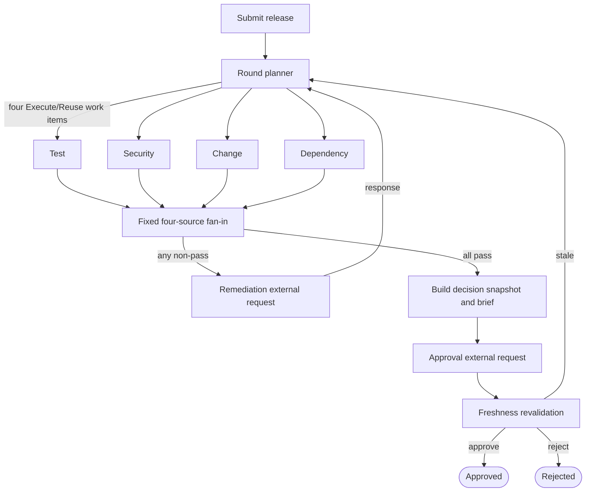

# Spec: Release Readiness Coordinator

**Status:** Approved input for implementation planning  
**Document role:** Sole authoritative project specification  
**Last updated:** 2026-08-11

## 1. Authority and change control

Apply project information in this order:

1. An explicit instruction from the project owner for the current task.
2. This specification.
3. The approved files under `tasks/`.
4. Existing code, tests, configuration, and other documentation.

This specification defines the product scope, required behavior, settled architecture, engineering boundaries, and success criteria. Planning artifacts may explain how to implement it, but they must not weaken, reinterpret, or override it.

Do not modify this file silently. A material deviation must be identified, justified, and approved by the project owner before implementation.

## 2. Objective and portfolio signal

Release Readiness Coordinator is a bounded .NET portfolio MVP demonstrating Microsoft Agent Framework workflow orchestration through a realistic enterprise release-governance process.

The system coordinates readiness evidence produced by simulated external systems before a production release. It does not run tests, perform security scans, manage change systems, execute deployments, or replace CI/CD.

The MVP must visibly demonstrate:

- four independent readiness checks executed as one parallel evaluation round;
- fan-out and complete fan-in aggregation;
- expected branch-local blockers, missing evidence, and transient failures;
- durable waits for external remediation and human approval;
- selective re-execution of affected checks;
- safe reuse of successful and still-current results;
- checkpoint-based recovery after application restart;
- rejection of stale human decisions;
- one narrowly bounded LLM task separated from deterministic policy.

The target is one understandable workflow, not a miniature release-management platform.

## 3. Actors

### Release coordinator

Can:

- submit a release candidate and initial evidence;
- inspect workflow, evidence, findings, and evaluation history;
- supply corrected evidence or release information;
- explicitly invalidate affected checks when submitting remediation.

### Release manager

Can:

- inspect the latest fully passing evaluation snapshot and deterministic decision brief;
- approve or reject the release;
- provide an actor name and decision comment.

The MVP does not require production-grade identity or authorization. Actor names may be entered manually.

## 4. Primary end-to-end journey

1. A release coordinator submits one release candidate.
2. Test, Security, Change, and Dependency checks run as one evaluation round.
3. Each branch promptly returns one structured result.
4. The workflow forms a complete four-branch result view.
5. When any branch blocks, lacks evidence, or exhausts a known transient retry, the workflow creates one remediation request after fan-in and pauses.
6. The coordinator supplies corrected evidence or release information.
7. A new evaluation round executes only branches that are unsuccessful, affected, invalid, expired, or explicitly invalidated.
8. Successful and still-valid branch results are reused without recomputation.
9. When all four branches pass, the workflow creates an immutable decision snapshot and deterministic decision brief, then pauses for a human decision.
10. Before accepting approval or rejection, the workflow revalidates the snapshot and all evidence freshness conditions.
11. A current approval or rejection is persisted as a terminal decision.
12. A stale response is rejected, affected checks are invalidated, and selective evaluation resumes.
13. A workflow waiting for remediation or approval can be restored after the application is stopped and restarted.

The UI and timeline must make every evaluation round understandable, especially which checks were **Executed** and which were **Reused**.

## 5. Release submission

A release submission contains:

- unique release identifier and revision;
- service name;
- release version;
- requested deployment window;
- rollback-plan text;
- dependency requirements;
- initial Test, Security, Change, and Dependency evidence or references to local simulated evidence.

Duplicate identifier/revision submissions return a conflict. Approved and rejected revisions are terminal and cannot be reopened. A materially changed release after a terminal decision requires a new revision.

## 6. Workflow semantics

### 6.1 Expected branch outcomes

Each readiness branch finishes promptly with exactly one expected outcome:

- `Passed`;
- `Blocked`;
- `MissingEvidence`;
- `TransientFailure`.

A readiness branch must never wait for a person or remain alive while evidence is corrected. Waiting is owned by the post-fan-in workflow.

Expected missing evidence, deterministic policy blockers, and exhausted known transient integration failures are domain outcomes. Unexpected programming errors, corrupted state, invariant violations, and unrecoverable persistence failures remain technical workflow failures.

### 6.2 Separate state dimensions

Do not create one universal status enum. Keep these concepts separate:

- process phase: `Evaluating`, `WaitingForRemediation`, `WaitingForApproval`, `Approved`, `Rejected`, or `Failed`;
- branch outcome: `Passed`, `Blocked`, `MissingEvidence`, or `TransientFailure`;
- execution disposition: `Executed` or `Reused`;
- computed result validity: current, expired, or invalidated, with reason codes.

### 6.3 Aggregation

Every evaluation round must produce one result for each of Test, Security, Change, and Dependency.

The aggregator receives all four results before routing:

- all four `Passed` → build decision snapshot and request human approval;
- any non-pass result → create one remediation request containing every current problem and wait for remediation.

## 7. Minimal deterministic readiness policies

All authoritative readiness decisions are deterministic C# decisions.

Fixed MVP policy constants:

- Test, Security, and Dependency evidence is current for 24 hours unless an earlier evidence-specific bound applies;
- Test pass rate must be at least 95 percent;
- evidence release versions must match the submitted release version exactly;
- policy constants are code-owned and versioned.

| Branch | Required evidence and pass policy | Result mapping |
|---|---|---|
| Test | Test run version, completion time, pass rate, and critical-suite failures. Pass when version matches, pass rate is at least 95%, no critical suite failed, and evidence is current. | Missing record or required field → `MissingEvidence`; deterministic policy miss → `Blocked`; exhausted known source failure → `TransientFailure`; otherwise `Passed`. |
| Security | Scan version/time, unresolved critical findings, high findings, and approved exceptions with scope and expiry. Pass when version matches, no critical finding remains, every high finding has a matching exception valid through the release window, and evidence is current. | Missing scan or required exception facts → `MissingEvidence`; uncovered finding or invalid exception → `Blocked`; exhausted known source failure → `TransientFailure`; otherwise `Passed`. |
| Change | Change approval, approved window, and rollback-plan analysis. Pass when the change is approved, the requested deployment is wholly inside the approved window, and all required rollback checklist findings satisfy deterministic policy. | Missing approval or rollback text → `MissingEvidence`; unapproved, out-of-window, absent, or ambiguous checklist evidence → `Blocked`; exhausted known source/analyser failure → `TransientFailure`; otherwise `Passed`. |
| Dependency | Required/available versions, availability intervals, maintenance intervals, and observation time. Pass when versions are compatible, availability covers the release window, no maintenance interval conflicts, and evidence is current. | Missing required facts → `MissingEvidence`; incompatibility, unavailability, or conflict → `Blocked`; exhausted known source failure → `TransientFailure`; otherwise `Passed`. |

Do not implement a configurable policy language, generic rules engine, or user-configurable governance platform.

## 8. Selective rerun and safe reuse

Selective rerun is the defining feature. Rerunning every branch after remediation does not satisfy the specification.

A previous branch result may be reused only when it:

- passed;
- has not expired;
- is based on unchanged evidence;
- is based on unchanged relevant release inputs;
- was produced by the current policy version;
- for Change, was produced by the current rollback analyser version;
- has not been explicitly invalidated.

A branch must execute again when its prior result did not pass, its evidence changed or expired, a relevant release input changed, its policy/analyser version changed, or it was explicitly invalidated.

A reused branch must:

- perform no evidence-provider call;
- perform no policy-evaluator call;
- perform no LLM or analyser-cache call;
- verify the supplied hashes and versions defensively;
- emit a result for the new round linked to the source result and source round;
- explain why reuse was safe.

Use this explicit invalidation map; do not replace it with a generic dependency graph:

| Changed input | Invalidated checks |
|---|---|
| Release version | Test, Security, Change, Dependency |
| Requested deployment window | Security, Change, Dependency |
| Test/Security/Change/Dependency evidence | Matching branch only |
| Dependency requirements | Dependency |
| Rollback-plan text or analyser version | Change |
| Branch policy version | Matching branch only |
| Coordinator's explicit branch selection | Selected branches |
| Clock reaches a result's validity bound | That result's branch |

Every round and timeline entry must state `Executed because …` or `Reused from round N because …`.

## 9. LLM boundary

Rollback-plan checklist analysis is the only LLM-backed MVP capability.

The analyser receives rollback-plan text and an analyser version and returns structured findings for exactly:

1. application rollback;
2. database rollback;
3. configuration rollback;
4. verification steps;
5. rollback decision owner.

Each item returns:

- `Present`, `Absent`, or `Ambiguous`;
- a concise normalized observation;
- zero or more short exact supporting excerpts;
- character offsets for every supporting excerpt.

The analyser must abstain with `Absent` or `Ambiguous` when support is missing or unclear and must never invent rollback steps. Strict validation rejects unknown checklist items, mismatched excerpts, invalid offsets, and unsupported output.

Deterministic Change policy requires all five findings to be `Present`. The LLM must never:

- emit a branch readiness outcome;
- choose routing or rerun behavior;
- generate the authoritative decision brief;
- approve or reject a release.

Valid analysis may be cached by normalized rollback-content SHA-256 plus `AnalyzerVersion`. The version identifies the prompt, schema, model/deployment family, and parsing rules. Do not cache exhausted transient failures. A reused Change branch must not enter the analyser path at all.

Do not add release-metadata extraction, additional agents, agent handoffs, agent conversations, or LLM-generated authoritative summaries.

## 10. Human decision integrity

When all four branches pass, persist an immutable `DecisionSnapshot` containing:

- the passing evaluation round;
- resolved source result IDs and hashes for all four checks;
- relevant evidence and release fingerprints;
- policy and analyser versions;
- the earliest validity bound;
- a deterministic decision brief and brief hash.

Approval or rejection must reference the active human request and latest fully passing snapshot.

Before accepting a response, deterministically revalidate:

- current process phase and active request identity;
- snapshot identity and concurrency token;
- current evidence and relevant release-input fingerprints;
- policy and analyser versions;
- every result validity deadline;
- decision-brief hash.

A stale response is recorded as declined, with reasons. Only affected checks are invalidated and the workflow returns to selective evaluation. The old response must never be applied automatically after reevaluation.

A current approval or rejection is persisted once and is terminal for that release revision.

## 11. Retry and failure behavior

Retry only typed, known transient evidence-provider or rollback-analyser failures.

Use one initial attempt plus two immediate retries per executing branch, with no delay. Do not retry missing evidence or deterministic policy blockers. Retry exhaustion returns `TransientFailure` with attempt details.

Do not add durable timers, retry workers, queues, schedulers, exponential-backoff infrastructure, or a general resilience platform.

Unclassified exceptions, corrupted checkpoints, impossible workflow invariants, and unrecoverable SQLite failures fail the workflow technically and make that failure visible.

## 12. Settled architecture

### 12.1 Application shape

Build one deployable ASP.NET Core .NET 10 application with:

- server-rendered Razor Pages and normal POST/redirect/GET interactions;
- one small domain/workflow layer in the same bounded solution;
- EF Core with SQLite for business and audit state;
- local in-process, JSON, or SQLite-backed simulated evidence providers;
- one `IChatClient`-backed rollback-plan analyser;
- no separate client, service, worker, queue, scheduler, broker, event bus, or real-time channel.

An HTTP request starts or resumes a workflow and runs it until the next external request or terminal result. Do not introduce a startup worker that automatically resumes workflows.

### 12.2 Microsoft Agent Framework

Pin `Microsoft.Agents.AI.Workflows` to exact version `1.17.0` for the MVP.

MAF must perform the real orchestration. Do not hide the process in an application-service loop behind a decorative MAF wrapper.

Use one static graph with stable executor IDs:



The planner emits exactly four `BranchWorkItem`s each round, one per readiness check, with disposition `Execute` or `Reuse`. Every branch emits exactly one `BranchResult`, allowing a deterministic fixed four-source fan-in while still ensuring reused checks perform no real work.

Represent remediation and approval with typed MAF external calls/`RequestPort`s. External requests occur only after fan-in. Pending requests must survive checkpoint restoration and resume through their correlated response.

Changing the MAF version requires source-driven reverification of fan-out/fan-in behavior, external-request restoration, checkpoint rehydration, and stable executor-ID compatibility before implementation continues.

### 12.3 Persistence and restart recovery

Use SQLite for:

- releases and revisions;
- immutable/versioned evidence;
- evaluation rounds and branch results;
- rollback analyses;
- remediation requests and submissions;
- decision snapshots and human responses;
- workflow correlation metadata;
- append-only display timeline entries.

Use MAF `FileSystemJsonCheckpointStore` in a dedicated application-data directory for workflow continuation. Keep MAF checkpoint data outside SQLite and store only stable correlation identifiers between the two stores.

Use one application-lifetime checkpoint store and external synchronization around start/resume access because the store is process-exclusive and not thread-safe. This is a small critical section, not a queue or background execution architecture.

The checkpoint store is workflow-continuation truth; idempotent SQLite records are business-history truth. Their writes are not atomic. Use stable operation keys and reconciliation to make replayed business writes harmless.

On release-detail or response requests, reconstruct the identical graph with stable executor IDs, restore the latest valid checkpoint, verify the re-emitted request ID and type, and send the correlated response. Missing, corrupt, or incompatible continuation state becomes a visible technical failure; never silently start a fresh workflow.

The MVP must demonstrate:

1. reach a remediation or approval wait;
2. stop the application;
3. restart it;
4. open the existing release;
5. restore the same workflow;
6. submit the pending response;
7. continue without duplicate business records.

### 12.4 Core domain concepts

The plan and implementation must preserve these concepts without turning them into a generic framework:

- `ReleaseSubmission` / release revision;
- immutable or versioned `EvidenceRecord`;
- `BranchWorkItem` with `Execute|Reuse`;
- `BranchResult` with outcome, disposition, fingerprints, versions, validity, attempts, findings, and optional reuse source;
- complete `EvaluationRound` containing one result per check;
- `RemediationRequest` and `RemediationSubmission`;
- immutable `DecisionSnapshot`;
- correlated `HumanResponse` and validation result;
- workflow correlation record;
- append-only display timeline.

Use EF Core directly through a bounded application data service. Do not add generic repositories, CQRS infrastructure, or event sourcing.

## 13. Minimum UI

Use Razor Pages and manual refresh. The MVP UI contains only:

- **Submit release:** release metadata, deployment window, rollback text, dependency requirements, and compact simulated evidence inputs or demo fixtures;
- **Release/workflow detail:** process phase, four current results, evidence and findings, evaluation-round history, `Executed`/`Reused` reasons and source links, deterministic brief, active wait, and chronological timeline;
- **Remediation interaction:** active problems, corrected evidence/release inputs, explicit invalidations, and request correlation token;
- **Decision interaction:** immutable snapshot/brief, Approve/Reject controls, actor, comment, request/snapshot identity, and stale-response feedback.

Do not add SPA state, SignalR, a design system, complex authentication/authorization, notifications, analytics, or deployment execution.

## 14. Testing and evaluation strategy

Testing follows policy and orchestration risk, not a test-count target.

### Deterministic tests

Use data-driven tests for:

- readiness-policy boundaries and result mapping;
- version, deployment-window, security-exception, maintenance-overlap, and freshness rules;
- retry classification and limits;
- selective reuse across evidence/input/time/policy/analyser/explicit invalidation changes;
- snapshot freshness and stale-response handling.

### Workflow tests

Use a small set of real-graph scenarios covering:

1. all checks pass and a current human approval terminates `Approved`;
2. multiple checks block, remediation changes their inputs, only affected checks execute, and other checks reuse without provider/policy/LLM calls;
3. missing evidence or exhausted known transient failure aggregates, waits only after fan-in, and resumes;
4. the process restarts while waiting, restores checkpoint/domain correlation, re-emits the request, and resumes once;
5. evidence expires while awaiting approval, the response is declined as stale, and only affected checks rerun;
6. a current human rejection terminates `Rejected`.

### LLM evaluation

Use approximately ten curated rollback plans spanning complete plans, each missing checklist item, ambiguous ownership, misleading headings, contradictory steps, and citation fidelity.

Evaluate:

- item classification;
- correct abstention;
- structured-output validity;
- exact citation grounding and offsets;
- deterministic Change-policy mapping;
- cache-key and invalidation behavior.

Normal automated tests use deterministic fakes or recorded structured responses. A credentialed provider smoke test is optional and explicitly enabled; it is not part of normal CI.

### UI verification

Use minimal browser smoke coverage for:

- submit → passing round → human decision;
- blocker → remediation → selective rerun.

Do not test DTO properties, constructors, obvious EF mappings, framework DI wiring, or redundant permutations.

## 15. Repository and commands

The repository is initially greenfield. The implementation plan must establish one solution, one deployable web application, and a focused test project. Prefer this top-level shape without inventing additional layers:

```text
SPEC.md
AGENTS.md                 # minimal repository operating guide once paths exist
tasks/
  plan.md                 # generated by planning-and-task-breakdown
  todo.md                 # generated checklist
src/
  ...                     # one ASP.NET Core application
tests/
  ...                     # focused automated tests
```

After the first setup task, these root-level commands must work and be recorded in `AGENTS.md` with actual project paths where required:

```text
dotnet restore
dotnet build --no-restore
dotnet test --no-build
dotnet format --verify-no-changes
```

The implementation plan may choose exact solution, project, namespace, and folder names. It must not introduce extra deployable components or speculative architectural layers.

## 16. Code and delivery conventions

- Enable nullable reference types and use async APIs for I/O.
- Prefer explicit, typed workflow messages and small concrete components.
- Keep process phase, branch outcome, disposition, and validity separate.
- Preserve immutable/versioned evidence and append-only history where specified.
- Use an injectable clock for all time-dependent behavior.
- Prefer the smallest concrete implementation that satisfies this specification.
- Do not create abstractions for hypothetical future use.
- Do not pull later capabilities into the current task.
- Do not commit, push, create branches, modify issues, or create pull requests unless explicitly requested.
- Review the complete diff and report unrun verification, residual risks, and any deviation from this specification.

## 17. Boundaries

### Always

- use MAF for the real workflow graph and external waits;
- keep release-readiness authority deterministic;
- preserve selective rerun and provably safe reuse;
- wait only after complete fan-in;
- distinguish expected outcomes from technical failures;
- retain exactly one LLM-backed MVP capability;
- keep business history and MAF continuation conceptually separate;
- verify MAF-specific assumptions against version-matched official sources when changing framework behavior.

### Ask first

- changing this specification;
- changing the pinned MAF version or fixed graph strategy;
- adding a package not already justified by the specification;
- changing public contracts or persisted-state semantics after they exist;
- adding another deployable component or background process;
- expanding the LLM's authority or adding another LLM capability;
- adding authentication, authorization, notifications, or deployment behavior.

### Never for the MVP

- real Azure DevOps, GitHub, Teams, ServiceNow, Jira, scanner, test-runner, or deployment integrations;
- distributed services, brokers, event buses, durable timers, or schedulers;
- event sourcing, CQRS infrastructure, generic repositories, plugin systems, dynamic workflow builders, or configurable policy engines;
- multi-agent conversations, handoffs, or specialist-agent teams;
- automatic release approval;
- release-metadata extraction or predictive release-risk scoring;
- reopening rejected releases;
- cancellation unless the completed core MVP is deliberately extended by the owner;
- complex identity, notifications, analytics, or production deployment execution.

## 18. MVP acceptance criteria

The MVP is complete when all of the following are demonstrably true:

1. A release can be submitted through the web UI.
2. MAF visibly fans out to Test, Security, Change, and Dependency and aggregates one result from each.
3. All four expected branch outcomes are represented without converting technical defects into domain results.
4. Multiple branch problems create one post-fan-in remediation request.
5. Remediation starts a new round that executes only affected/invalid checks and reuses other valid results without provider, policy, or LLM calls.
6. Round history and timeline explain execution versus reuse and link reused results to their source round.
7. A waiting workflow survives application stop/restart and resumes the same pending request without duplicate domain records.
8. Rollback text is analysed into citation-grounded checklist findings by the sole LLM-backed capability, while deterministic C# decides Change readiness.
9. A fully passing round produces an immutable snapshot and deterministic decision brief.
10. A current human approval or rejection is terminal.
11. A stale human response is rejected and routes only affected checks back to selective evaluation.
12. The targeted deterministic, workflow, restart, LLM-evaluation, and UI checks pass.
13. The implementation remains one bounded application and contains none of the prohibited platform or multi-agent expansion.

## 19. Risks, assumptions, and open decisions

### Accepted risks and assumptions

- `Microsoft.Agents.AI.Workflows` 1.17.0 is intentionally pinned; upgrades are separate, source-verified decisions.
- SQLite and filesystem checkpoints cannot share a transaction; stable operation keys and reconciliation bound this local-demo risk.
- `FileSystemJsonCheckpointStore` constrains the MVP to one process, which is intentional.
- Simulated local evidence is authoritative for the MVP.
- Actor names are entered rather than authenticated.

### Genuine open decisions for planning

- exact solution, project, namespace, and folder names;
- exact `IChatClient` provider/deployment available to the owner, provided it supports the required structured output;
- exact UI page names and presentation details within the minimum UI boundary.

No other architectural decision should be reopened during task planning unless repository reality or version-matched official MAF behavior directly conflicts with this specification.

## 20. Framework verification references

The settled MAF architecture was based on version-matched official material for 1.17.0:

- [Microsoft Agent Framework .NET releases](https://github.com/microsoft/agent-framework/releases)
- [Microsoft.Agents.AI.Workflows 1.17.0 package](https://www.nuget.org/packages/Microsoft.Agents.AI.Workflows/1.17.0)
- [Workflow execution model](https://learn.microsoft.com/en-us/agent-framework/workflows/workflows)
- [Human-in-the-loop external requests](https://learn.microsoft.com/en-us/agent-framework/workflows/human-in-the-loop)
- [FileSystemJsonCheckpointStore API](https://learn.microsoft.com/en-us/dotnet/api/microsoft.agents.ai.workflows.checkpointing.filesystemjsoncheckpointstore?view=agent-framework-dotnet-latest)
