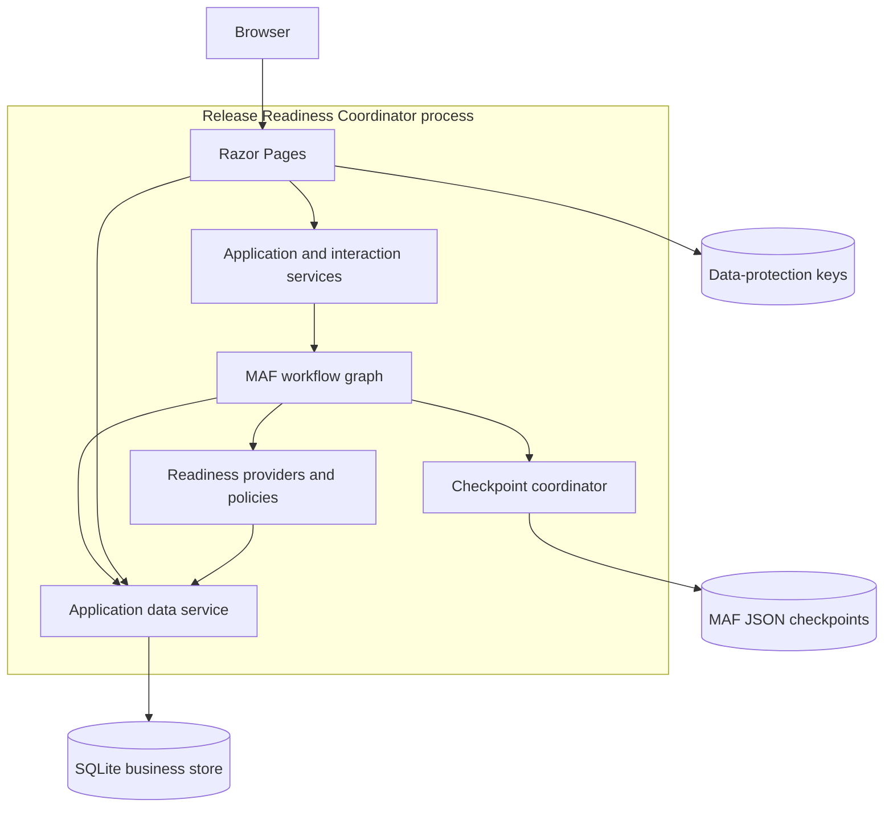
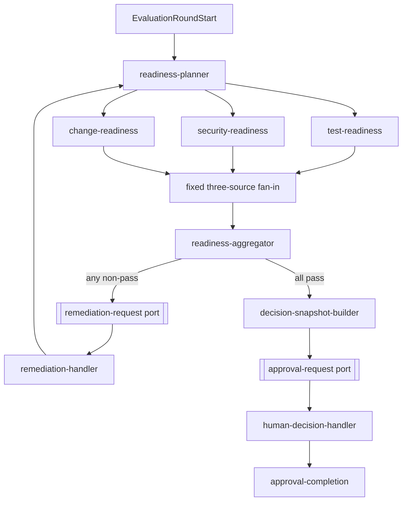
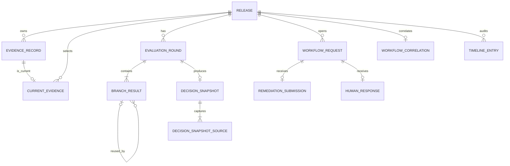

# Architecture

This document describes the implemented technical structure of Release Readiness Coordinator. It focuses on module boundaries, runtime flow, workflow topology, persistence, continuation safety, and the places a maintainer should change for each kind of behavior.

For setup and operating instructions, see the [technical guide](technical-guide.md). The [project specification](../SPEC.md) remains authoritative for product requirements and architectural constraints.

## Architectural style

Release Readiness Coordinator is a modular monolith with one deployable ASP.NET Core Razor Pages application and one test project. The application contains the UI, workflow graph, deterministic policy code, and persistence adapters in one process.

The design is shaped by five boundaries:

1. HTTP requests, not a background worker, start or resume workflow turns.
2. Microsoft Agent Framework (MAF) owns orchestration, fan-out, fan-in, and external waits.
3. Deterministic C# owns every readiness and reuse decision.
4. SQLite owns business facts and audit history; filesystem checkpoints own MAF continuation state.
5. The application remains single-machine and process-exclusive around checkpoint access.

There are no separate APIs, client applications, workers, queues, brokers, schedulers, or event buses.

## Runtime composition

[Program.cs](../src/ReleaseReadinessCoordinator/Program.cs) is the composition root. It resolves the application-data directory and registers these important lifetimes:

| Service | Lifetime | Reason |
|---|---|---|
| `TimeProvider.System` | Singleton | One injectable source for workflow, interaction, and audit timestamps |
| `AppDbContext` | Scoped | One EF Core unit of work per HTTP request scope |
| `IApplicationDataService` | Scoped | Bounded business persistence over the scoped context |
| `ReleaseWorkflowService` | Scoped | Coordinates one request's start, restore, or resume operation |
| Remediation and decision interaction services | Scoped | Validate the current durable interaction before invoking the workflow |
| `CheckpointStoreCoordinator` | Singleton | Owns the process-exclusive checkpoint store and application-wide gates |

Startup calls `EnsureCreatedAsync` for the local SQLite schema. The project is a pre-release local demo and does not use a database-migration pipeline.

ASP.NET Core data-protection keys are persisted beside the other application data so server-rendered form protection remains stable across restarts.

## Workflow graph

[ReleaseWorkflowFactory.cs](../src/ReleaseReadinessCoordinator/Workflow/ReleaseWorkflowFactory.cs) constructs one static graph using the pinned `Microsoft.Agents.AI.Workflows` 1.17.0 package. The graph is rebuilt for every start or continuation, so executor IDs, port IDs, message contracts, and topology are compatibility-sensitive.

The stable runtime identities are defined in [ReadinessExecutors.cs](../src/ReleaseReadinessCoordinator/Workflow/ReadinessExecutors.cs):

| Runtime ID | Component | Responsibility |
|---|---|---|
| `readiness-planner` | `ReadinessPlanner` | Reads durable history and emits exactly three work items |
| `test-readiness` | `ReadinessBranchExecutor` | Executes or reuses the Test result |
| `security-readiness` | `ReadinessBranchExecutor` | Executes or reuses the Security result |
| `change-readiness` | `ReadinessBranchExecutor` | Executes or reuses the Change result |
| `readiness-aggregator` | `ReadinessAggregator` | Accepts one result per branch, persists the round, and selects the next route |
| `remediation-handler` | `RemediationWorkflowExecutor` | Persists remediation and starts the next round |
| `decision-snapshot-builder` | `DecisionSnapshotWorkflowExecutor` | Persists the immutable passing snapshot and approval request |
| `human-decision-handler` | `HumanDecisionWorkflowExecutor` | Persists the correlated terminal response |
| `approval-completion` | `ApprovalCompletionExecutor` | Exposes the persisted response as workflow output |

The two request ports are `remediation-request` and `approval-request`. Their checkpointed application payloads contain only the durable domain request ID, not evidence, findings, snapshots, or decision briefs.

## Evaluation-round mechanics

### Planning

[RoundPlanner.cs](../src/ReleaseReadinessCoordinator/Workflow/RoundPlanner.cs) receives the previous branch results, current evidence IDs, and any explicit selections. It produces one `BranchWorkItem` for each fixed check.

The execution-reason precedence is:

1. no previous result → `InitialEvaluation`;
2. explicitly selected for rerun → `ExplicitlySelected`;
3. current evidence identity changed → `EvidenceChanged`;
4. previous result did not pass → `PreviousResultNotPassed`;
5. otherwise reuse the previous pass → `UnchangedEvidence`.

This keeps the reason deterministic even when several conditions are true. Additional true conditions remain in the explanatory text.

### Execute path

[BranchExecution.cs](../src/ReleaseReadinessCoordinator/Readiness/BranchExecution.cs) retrieves current evidence and evaluates it with the branch-specific policy. Only `KnownTransientEvidenceProviderException` is retried, immediately, for a maximum of three attempts. Missing evidence and deterministic blockers return normal branch outcomes; unclassified exceptions remain technical failures.

The policies are separate concrete components:

- `TestPolicy.cs` checks version, pass rate, and critical-suite failures.
- `SecurityPolicy.cs` checks version, findings, and exception scope and expiry through the requested deployment window.
- `ChangePolicy.cs` checks approval and deployment-window containment.

### Reuse path

[ResultReuse.cs](../src/ReleaseReadinessCoordinator/Workflow/ResultReuse.cs) makes no provider or policy call. It defensively verifies that the source:

- belongs to the same release and branch;
- comes from an earlier round;
- passed and references evidence;
- references the exact evidence record currently selected for the branch;
- was not explicitly selected for rerun.

Reuse emits a new immutable result linked to the source result and source round. Historical results are never mutated, and elapsed time alone never invalidates a passing result.

### Fan-in and routing

MAF provides the fixed three-source fan-in barrier. `ReadinessAggregator` additionally rejects duplicate branches or results attributed to the wrong executor. [RoundAggregator.cs](../src/ReleaseReadinessCoordinator/Workflow/RoundAggregator.cs) then persists the complete round and timeline entry.

- Any non-pass result opens one remediation request containing all current problems.
- Three passing results route to [DecisionSnapshotBuilder.cs](../src/ReleaseReadinessCoordinator/Workflow/DecisionSnapshotBuilder.cs), which captures the three result and evidence sources and byte-stable decision brief.

## HTTP and workflow lifecycles

### New release

1. `NewModel` validates the form and maps it to `ReleaseSubmission` plus zero to three initial evidence records.
2. `ReleaseSubmissionApplicationService` saves the release, initial evidence, and first timeline entry in SQLite.
3. It derives a stable workflow session ID from the immutable release ID.
4. `ReleaseWorkflowService` builds the graph and starts round 1 through `CheckpointStoreCoordinator`.
5. The graph evaluates until it reaches exactly one remediation or approval request port.
6. MAF writes the checkpoint; the workflow's handlers have already persisted the round and durable domain request.
7. The service stores the session ID and pending workflow/domain request tuple in SQLite.
8. Razor Pages redirects to the release detail page.

### Remediation

1. The remediation GET reads the active durable request and current evidence from SQLite.
2. The form carries the MAF workflow request ID as its correlation token.
3. On POST, changed fields become new immutable evidence versions; unchanged fields create no replacement.
4. The interaction service verifies the current phase, request, and correlation token.
5. `ReleaseWorkflowService` rebuilds the graph, restores the latest checkpoint, and exactly reconciles the pending MAF request with the SQLite-derived expected tuple.
6. The response enters the restored remediation port. The handler closes the request, advances current-evidence pointers, appends the submission and timeline entry, and emits the next `EvaluationRoundStart`.
7. The graph reaches the next remediation or approval wait, and SQLite correlation is updated to that new wait.

### Approval or rejection

1. Loading the decision page proactively rebuilds and restores the workflow to prove that the checkpoint still contains the expected approval request.
2. The page renders the immutable snapshot and brief from SQLite, never from checkpoint payload content.
3. On POST, the application rebuilds and restores again, reconciles the exact request identity and typed port contract, then sends the response through MAF.
4. `HumanDecisionHandler` saves one terminal response, closes the active request, transitions the release to `Approved` or `Rejected`, and appends the timeline entry.
5. The terminal response becomes the workflow output. Human decisions never route back to evaluation.

The response approves or rejects the immutable point-in-time snapshot. The MVP does not compare current evidence identities or re-evaluate Change-window containment or Security-exception coverage when the response arrives.

## Domain model and invariants

The domain uses immutable records and separate state dimensions instead of one overloaded status:

| Concept | Important types |
|---|---|
| Release identity and phase | `ReleaseId`, `ReleaseSubmission`, `Release`, `ProcessPhase` |
| Evidence history | `EvidenceRecord` and Test, Security, Change specializations |
| Planning | `BranchWorkItem`, `WorkDisposition`, `PlanningReason` |
| Evaluation | `BranchResult`, `BranchOutcome`, `ExecutionDisposition`, `EvaluationRound` |
| External interactions | `RemediationRequest`, `RemediationSubmission`, `HumanDecisionRequest`, `HumanResponse` |
| Decision integrity | `DecisionSnapshot` |
| Continuation and audit | `WorkflowCorrelationRecord`, `TimelineEntry` |

Constructors enforce invariants such as positive round and evidence versions, UTC-only instants, one result per check, passing results requiring evidence, and reused results requiring a valid source link. EF Core configuration repeats critical uniqueness, foreign-key, immutability, and state constraints at the persistence boundary.

## Persistence model

`ApplicationDataService` is the only business persistence boundary. It maps between immutable domain records and internal EF Core row types; workflow and page code do not manipulate `AppDbContext` directly.

Key persistence rules include:

- Evidence history is append-only; `CurrentEvidence` is the only mutable selection pointer.
- Evaluation rounds contain one unique result per check.
- A release can have only one active workflow request.
- A release can have only one terminal human response.
- Snapshot sources reference the exact branch results and evidence approved by the human.
- Stable operation keys make retried writes replay-safe; reuse of a key with different content is a conflict.
- Concurrency tokens protect mutable release, current-evidence, request, and correlation rows.
- `ReleaseDetailProjection` reads a consistent, complete view of one release inside a SQLite transaction.

Each bounded mutation is persisted with one EF Core `SaveChangesAsync` unit. SQLite and MAF checkpoint writes cannot share a transaction.

## Checkpoint and continuation model

[CheckpointStoreCoordinator.cs](../src/ReleaseReadinessCoordinator/Workflow/CheckpointStoreCoordinator.cs) wraps MAF's `FileSystemJsonCheckpointStore` and `CheckpointManager`.

SQLite and checkpoint storage have different authority:

| Concern | Authority |
|---|---|
| Release, evidence, results, requests, snapshots, responses, timeline | SQLite |
| Expected session ID and pending request tuple | SQLite workflow correlation |
| Executor position, messages, executor state, external-request envelope | MAF checkpoint |
| Domain request ID carried by the pending workflow request | Minimal typed checkpoint reference |

For every continuation, the application:

1. reads the expected session and wait identity from SQLite;
2. rebuilds the identical graph from immutable release metadata;
3. loads the latest checkpoint for that session;
4. asks MAF to rehydrate the run;
5. verifies the port ID, request type, response type, MAF request ID, and durable domain request ID;
6. only then renders approval content or sends a response.

Missing, corrupt, mismatched, and graph-incompatible continuation states fail closed. The application never starts a replacement workflow for an existing release.

The checkpoint store is process-exclusive and not thread-safe. The singleton coordinator serializes complete workflow operations and store access with asynchronous gates. This makes the implementation safe for one application process, but it intentionally prevents horizontal scaling and can introduce head-of-line blocking between releases.

Because a checkpoint and SQLite cannot commit atomically, there are short recovery windows between stores. Stable operation keys, exact replay comparison, database constraints, and request-identity reconciliation make repeated work harmless or fail it explicitly.

## Failure and replay behavior

Expected release problems stay inside branch results. Technical failures—programming errors, impossible state, SQLite failures, and invalid continuation—are caught by `ReleaseWorkflowService`, transition the release to `Failed`, and add a diagnostic timeline entry. Cancellation is propagated and is not converted into workflow failure.

Replay behavior is content-sensitive:

- an identical remediation or human response can return the already persisted result;
- the same operation or response ID with different content is rejected;
- terminal releases cannot be reopened;
- a stale form or mismatched workflow request produces no new business record.

## Testing architecture

The test project mirrors the production concerns:

| Test area | What it protects |
|---|---|
| `Domain/` | Constructor invariants, evidence identity, reuse, and snapshot contracts |
| `Readiness/` | Policy boundaries, retry classification, and branch-result mapping |
| `Workflow/` | Real graph topology, fan-in, selective reuse, external requests, checkpoint contracts, and restart recovery |
| `Data/` | Schema constraints, immutability, replay safety, and release projections |
| `Web/` | Razor handlers, validation, PRG behavior, rendered detail, and safe continuation feedback through Kestrel |
| `Support/` | Temporary databases, application factories, scenario builders, and counting fakes |

`TimeProvider` keeps recorded workflow and audit timestamps controllable, while data-backed provider interfaces isolate side effects. Workflow scenario tests use the real graph; counting fakes prove that reused branches perform no provider or policy work.

## Where to make changes

| Change | Primary location | Also verify |
|---|---|---|
| Readiness threshold or finding rule | Matching file under `Readiness/` | Readiness tests and `SPEC.md` approval requirements |
| Selective-rerun precedence | `Workflow/RoundPlanner.cs` | `SelectiveRerunTests` and displayed planning explanations |
| Workflow topology, executor, or port | `ReleaseWorkflowFactory.cs`, `ReadinessExecutors.cs` | Checkpoint compatibility and all workflow/restart tests |
| Domain invariant | Matching file under `Domain/` | EF constraints, mappings, deterministic tests |
| Persisted shape or transaction behavior | `Data/` | Disposable local-state policy, schema tests, both ADRs |
| Form or rendered detail | `Pages/` | Razor/Kestrel tests and manual journeys |
| New interaction use case | A focused service under `Workflow/` | Request correlation, idempotency, and application boundary |

Do not introduce another deployable component or bypass MAF with an application-service orchestration loop.

## Related decisions

- [ADR-001: Use process-exclusive filesystem checkpointing](decisions/ADR-001-use-process-exclusive-filesystem-checkpointing.md)
- [ADR-002: Keep domain content authoritative in SQLite](decisions/ADR-002-keep-domain-content-authoritative-in-sqlite.md)
- [MVP acceptance matrix](acceptance-matrix.md)
