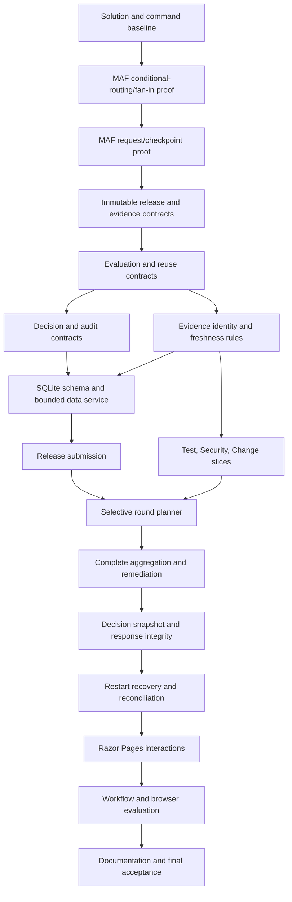

# Implementation Plan: Release Readiness Coordinator MVP

## Overview

Build the approved `SPEC.md` as one ASP.NET Core .NET 10 Razor Pages application named `ReleaseReadinessCoordinator`, backed by EF Core/SQLite for business history and Microsoft Agent Framework (MAF) filesystem checkpoints for workflow continuation. The implementation will deliver one fixed three-branch release-readiness workflow, deterministic policies and routing, safe selective reuse, typed remediation and approval waits, restart recovery, and a minimal server-rendered UI. Work is ordered to prove the highest-risk MAF 1.17.0 behavior before building business features.

## Planning Basis

- `SPEC.md` is the sole authoritative product and architecture specification.
- Tasks 1-7 are implemented and verified in the current repository; remaining work starts with the durable SQLite foundation.
- The NuGet V3 package index was checked on 2026-08-11 and includes `Microsoft.Agents.AI.Workflows` version `1.17.0`.
- Official MAF documentation confirms the planned superstep synchronization barrier, typed `RequestPort` external requests, checkpoint capture of pending requests, stable topology/executor identity requirements during rehydration, and the process-exclusive/non-thread-safe filesystem checkpoint store. Because some API reference pages display an older package label, Tasks 2 and 3 require compiled 1.17.0 contract tests before feature implementation continues.

Official references:

- [Workflow builder and execution](https://learn.microsoft.com/en-us/agent-framework/concepts/workflows/builder-and-execution)
- [Human-in-the-loop requests](https://learn.microsoft.com/en-us/agent-framework/workflows/human-in-the-loop)
- [Workflow checkpoints](https://learn.microsoft.com/en-us/agent-framework/workflows/checkpoints)
- [FileSystemJsonCheckpointStore](https://learn.microsoft.com/en-us/dotnet/api/microsoft.agents.ai.workflows.checkpointing.filesystemjsoncheckpointstore?view=agent-framework-dotnet-latest)
- [Microsoft.Agents.AI.Workflows package](https://www.nuget.org/packages/Microsoft.Agents.AI.Workflows/1.17.0)

## Settled Implementation Shape

- Solution: `ReleaseReadinessCoordinator.slnx`
- Web project: `src/ReleaseReadinessCoordinator/ReleaseReadinessCoordinator.csproj`
- Test project: `tests/ReleaseReadinessCoordinator.Tests/ReleaseReadinessCoordinator.Tests.csproj`
- Root namespace: `ReleaseReadinessCoordinator`
- Razor routes:
  - `/Releases/New`
  - `/Releases/{releaseId}/{revision}`
  - `/Releases/{releaseId}/{revision}/Remediate`
  - `/Releases/{releaseId}/{revision}/Decision`
- One bounded application data service uses EF Core directly. There are no generic repositories, CQRS layers, event sourcing, workers, queues, or additional deployables.
- Built-in `TimeProvider` is injected for all time-sensitive logic.
- Release metadata is immutable within a revision. Remediation replaces only immutable/versioned branch evidence, and planner reuse compares current evidence IDs, policy versions, and `ValidUntil` deadlines.
- Policy versions are code-owned constants. Initial identifiers use explicit semantic strings such as `test-policy/1`.
- Local simulated providers implement typed evidence-source contracts. Only known typed transient failures receive one initial attempt plus two immediate retries.
- SQLite stores immutable/versioned business records and an append-only timeline. MAF checkpoints live under a configurable private application-data directory that is excluded from source control.
- Stable operation keys make replayed SQLite writes idempotent. A single application-lifetime checkpoint store is protected by an async critical section.

## Dependency Graph

## Task List

Detailed acceptance criteria, verification commands, dependencies, and likely files are in `tasks/todo.md`.

### Phase 1: Fail-Fast Framework Foundation

- [x] Task 1: Bootstrap the .NET 10 solution and command baseline
- [x] Task 2: Prove the fixed MAF three-branch graph
- [x] Task 3: Prove typed waits and checkpoint rehydration

### Checkpoint A: Framework Viability

- [x] Exact MAF 1.17.0 reference restores and compiles
- [x] A real graph emits exactly three branch results before aggregation
- [x] A pending typed request survives filesystem-checkpoint rehydration
- [ ] Human review confirms no version or topology deviation is required

### Phase 2: Domain and Durable Business History

- [x] Task 4: Model immutable releases and versioned evidence
- [x] Task 5: Define evaluation and selective-reuse contracts
- [x] Task 6: Define decision, correlation, and audit contracts
- [x] Task 7: Establish evidence-identity and freshness rules

### Checkpoint B1: Domain Semantics

- [x] Immutable releases/evidence and durable decision/audit vocabulary are defined
- [x] Phase, outcome, disposition, and planning reason remain separate bounded concepts
- [x] Evidence-identity and freshness-deadline rules are covered by deterministic tests

- [x] Task 8: Create the SQLite schema and migrations
- [x] Task 9: Implement the bounded idempotent application data service

### Checkpoint B2: Durable Foundation

- [x] SQLite schema, constraints, and replay-safe writes are verified
- [x] Immutable/versioned records and append-only history are preserved

### Phase 3: Submission and Three Readiness Slices

- [x] Task 10: Deliver release submission and demo fixtures
- [ ] Task 11: Deliver the Test readiness slice
- [ ] Task 12: Deliver the Security readiness slice

### Checkpoint C1: Submission and First Policies

- [x] A release can be submitted once and starts a correlated workflow
- [ ] Test and Security boundaries/outcome mappings are verified

- [ ] Task 13: Deliver the Change readiness slice

### Checkpoint C2: Deterministic Readiness

- [ ] Every branch maps missing, blocked, transient, and passing outcomes correctly
- [ ] Retry count and classification are proven
- [ ] Change readiness uses approval, window, and rollback-text presence only

### Phase 4: Selective Workflow and Human Integrity

- [ ] Task 14: Implement selective execution and safe reuse planning
- [ ] Task 15: Complete aggregation and remediation resumption
- [ ] Task 16: Build immutable snapshots and handle human decisions

### Checkpoint D: Core End-to-End Workflow

- [ ] Every round contains three results with explicit Executed/Reused reasons
- [ ] Multiple current problems create one wait after complete fan-in
- [ ] Passing results form one immutable snapshot and deterministic brief
- [ ] Current decisions terminate; stale decisions selectively reevaluate

### Phase 5: Recovery and Minimal Razor UI

- [ ] Task 17: Add restart recovery, synchronization, and reconciliation
- [ ] Task 18: Build release detail and timeline UI

### Checkpoint E1: Recovery and Read Model

- [ ] Stop/restart/resume works for remediation and approval waits
- [ ] The detail page explains current state and immutable history

- [ ] Task 19: Build remediation interaction UI
- [ ] Task 20: Build decision interaction UI

### Checkpoint E2: Demonstrable MVP

- [ ] No replay creates duplicate business records
- [ ] Manual UI journeys expose evidence, findings, rounds, waits, and reasons

### Phase 6: Evaluation and Delivery

- [ ] Task 21: Complete real-graph workflow scenario coverage
- [ ] Task 22: Add minimal browser smoke coverage

### Checkpoint F1: Evaluation

- [ ] Required workflow and browser scenarios pass
- [ ] Test evidence covers orchestration risks and both user journeys

- [ ] Task 23: Finish documentation, full verification, and spec audit

### Checkpoint F2: Complete

- [ ] All 13 MVP acceptance criteria in `SPEC.md` are demonstrated
- [ ] Restore, build, tests, formatting, runtime checks, and browser checks pass
- [ ] No prohibited architecture has been introduced
- [ ] Complete diff is reviewed and residual risks/unrun checks are reported
- [ ] Human review approves implementation readiness

## Risks and Mitigations

| Risk | Impact | Mitigation |
|---|---|---|
| MAF 1.17.0 APIs differ from current documentation examples | High | Tasks 2-3 compile and execute version-pinned topology, request, checkpoint, and stable-ID probes before domain implementation. Any conflict is reported; the version is never changed silently. |
| SQLite writes and filesystem checkpoints cannot be atomic | High | Use stable operation keys, unique constraints, replay-safe upserts, correlation verification, and explicit reconciliation tests. |
| Reuse accidentally calls providers or policies | High | Represent Execute/Reuse in planner output, keep reuse as a separate defensive code path, inject counting fakes, and assert zero forbidden calls. |
| Incorrect immutable release metadata cannot be remediated in place | Medium | Validate submission strictly, make the limitation visible, and require a separate revision without adding supersession/cancellation behavior to the MVP. |
| A stale human response is accepted | High | Bind responses to request ID, snapshot ID, concurrency token, current evidence IDs, evaluator versions, and deadlines; persist declined responses with bounded reason codes. |
| Mutable release/evidence data erases audit history | Medium | Append immutable/versioned records and expose current projections without updating historical facts. |
| Checkpoint store is accessed concurrently or from multiple instances | Medium | Register one application-lifetime store, guard all start/resume access, document the single-process constraint, and test concurrent response handling. |
| UI scope expands beyond the portfolio MVP | Medium | Implement only four Razor routes, PRG interactions, manual refresh, and the exact fields/views in `SPEC.md`. |

## Open Questions

- Does the owner prefer any visual styling beyond accessible semantic HTML and a small local stylesheet? The default plan is deliberately minimal.

No other architectural decisions are reopened by this plan. A discovered conflict with MAF 1.17.0, a new package outside the specification, or a change to public/persisted contracts must be brought to the owner before implementation proceeds.

## Definition of Done Applied to Every Task

- Task-specific acceptance criteria are met and behavior is exercised at runtime.
- New behavior has focused tests that fail without the change; existing tests remain green.
- Error paths and specified edge cases are covered; no technical defect is converted to a domain outcome.
- Code is scoped, formatted, nullable-clean, async for I/O, and free of debug/dead code.
- Public behavior and material architecture decisions are documented when introduced.
- Security, observability, compatibility, and rollback implications are reviewed in proportion to the task.
- The task is not marked complete until its verification is run or explicitly reported as unrun.
