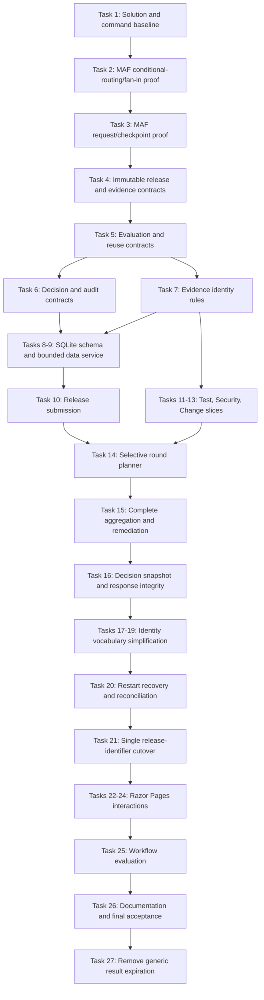

# Implementation Plan: Release Readiness Coordinator MVP

## Overview

Release Readiness Coordinator is one ASP.NET Core .NET 10 Razor Pages application backed by EF Core/SQLite for business history and Microsoft Agent Framework (MAF) filesystem checkpoints for workflow continuation. Tasks 1-26 delivered the fixed three-branch workflow, deterministic policies and routing, selective reuse, typed remediation and approval waits, restart recovery, and minimal server-rendered UI. Task 27 simplifies the final reuse contract to previous outcome, exact evidence identity, and explicit rerun selection. Human decision continues to use a closed immutable snapshot and terminal approval/rejection so the portfolio emphasizes MAF orchestration rather than production-grade continuously editable approval evidence.

## Planning Basis

- `SPEC.md` is the sole authoritative product and architecture specification.
- Tasks 1-26 are implemented and verified as the completed MVP baseline. Task 27 is a post-MVP simplification that updates the final domain contract without changing the fixed workflow topology.
- On 2026-08-19 the owner removed numeric release revisions from the MVP. Completed revision-bearing tasks remain historical records; Task 21 performs the compulsory single-identifier cutover before remaining UI work.
- The completed baseline originally included generic result expiration through `ValidUntil`, `FreshnessDeadlines`, deadline-driven reruns, and a decision-snapshot validity bound. On 2026-08-20 the owner deliberately removed that scope; Task 27 records and implements the coherent cross-cutting deletion while retaining intrinsic Change-window and Security-exception rules.
- The NuGet V3 package index was checked on 2026-08-11 and includes `Microsoft.Agents.AI.Workflows` version `1.17.0`.
- Official MAF documentation confirms the planned superstep synchronization barrier, typed `RequestPort` external requests, checkpoint capture of pending requests, stable topology/executor identity requirements during rehydration, and the process-exclusive/non-thread-safe filesystem checkpoint store. Because some API reference pages display an older package label, Tasks 2 and 3 require compiled 1.17.0 contract tests before feature implementation continues.

Official references:

- [Workflow builder and execution](https://learn.microsoft.com/en-us/agent-framework/concepts/workflows/builder-and-execution)
- [Human-in-the-loop requests](https://learn.microsoft.com/en-us/agent-framework/workflows/human-in-the-loop)
- [Workflow checkpoints](https://learn.microsoft.com/en-us/agent-framework/workflows/checkpoints)
- [FileSystemJsonCheckpointStore](https://learn.microsoft.com/en-us/dotnet/api/microsoft.agents.ai.workflows.checkpointing.filesystemjsoncheckpointstore?view=agent-framework-dotnet-latest)
- [Microsoft.Agents.AI.Workflows package](https://www.nuget.org/packages/Microsoft.Agents.AI.Workflows/1.17.0)

## Settled Implementation Shape

- Solution: `ReleaseReadinessCoordinator.slnx`
- Web project: `src/ReleaseReadinessCoordinator/ReleaseReadinessCoordinator.csproj`
- Test project: `tests/ReleaseReadinessCoordinator.Tests/ReleaseReadinessCoordinator.Tests.csproj`
- Root namespace: `ReleaseReadinessCoordinator`
- Razor routes:
  - `/Releases/New`
  - `/Releases/{releaseId}`
  - `/Releases/{releaseId}/Remediate`
  - `/Releases/{releaseId}/Decision`
- One bounded application data service uses EF Core directly. There are no generic repositories, CQRS layers, event sourcing, workers, queues, or additional deployables.
- Built-in `TimeProvider` is injected where the application records current workflow, interaction, and audit timestamps; readiness reuse does not depend on the clock.
- Every submission has one globally unique `ReleaseId`; there is no numeric revision or release-family relationship. Release metadata is immutable after submission, and corrections require a new release ID. Remediation replaces only immutable/versioned branch evidence, and planner reuse compares exact current evidence IDs with previous passing results plus explicit rerun selections.
- Evidence changes are allowed through remediation only and are locked while approval is pending. The restored typed MAF reference is the authority for approval-response correlation, while SQLite is the authority for decision content; human decision never routes back to the planner.
- Local simulated providers implement typed evidence-source contracts. Only known typed transient failures receive one initial attempt plus two immediate retries.
- SQLite stores immutable/versioned business records and an append-only timeline. MAF checkpoints live under a configurable private application-data directory that is excluded from source control.
- Stable operation keys make replayed SQLite writes idempotent. A single application-lifetime checkpoint store is protected by an async critical section.

## Dependency Graph

## Task List

Detailed acceptance criteria, verification commands, dependencies, and likely files are in `tasks/todo.md`.

### Phase 1: Fail-Fast Framework Foundation

- [x] Task 1: Bootstrap the .NET 10 solution and command baseline
- [x] Task 2: Prove the fixed MAF three-branch graph
- [x] Task 3: Prove typed waits and checkpoint rehydration

### Checkpoint A: Framework Viability

- [x] Exact MAF 1.17.0 reference restores and compiles
- [x] A real graph emits exactly three branch results before aggregation
- [x] A pending typed request survives filesystem-checkpoint rehydration
- [ ] Human review confirms no version or topology deviation is required

### Phase 2: Domain and Durable Business History

- [x] Task 4: Model immutable releases and versioned evidence
- [x] Task 5: Define evaluation and selective-reuse contracts
- [x] Task 6: Define decision, correlation, and audit contracts
- [x] Task 7: Establish evidence-identity rules

### Checkpoint B1: Domain Semantics

- [x] Immutable releases/evidence and durable decision/audit vocabulary are defined
- [x] Phase, outcome, disposition, and planning reason remain separate bounded concepts
- [x] Exact evidence identity is covered as the branch change-detection contract

- [x] Task 8: Create the SQLite schema and migrations
- [x] Task 9: Implement the bounded idempotent application data service

### Checkpoint B2: Durable Foundation

- [x] SQLite schema, constraints, and replay-safe writes are verified
- [x] Immutable/versioned records and append-only history are preserved

### Phase 3: Submission and Three Readiness Slices

- [x] Task 10: Deliver release submission and demo fixtures
- [x] Task 11: Deliver the Test readiness slice
- [x] Task 12: Deliver the Security readiness slice

### Checkpoint C1: Submission and First Policies

- [x] A release can be submitted once and starts a correlated workflow
- [x] Test and Security boundaries/outcome mappings are verified

- [x] Task 13: Deliver the Change readiness slice

### Checkpoint C2: Deterministic Readiness

- [x] Every branch maps missing, blocked, transient, and passing outcomes correctly
- [x] Retry count and classification are proven
- [x] Change readiness uses approval and approved-window containment only

### Phase 4: Selective Workflow and Human Integrity

- [x] Task 14: Implement selective execution and safe reuse planning
- [x] Task 15: Complete aggregation and remediation resumption
- [x] Task 16: Build immutable snapshots and terminal MAF human decisions
- [x] Task 17: Allocate round and result identities once
- [x] Task 18: Separate workflow waits from business requests
- [x] Task 19: Clarify persisted approval-response references

### Checkpoint D: Core End-to-End Workflow

- [x] Every round contains three results with explicit Executed/Reused reasons
- [x] Multiple current problems create one wait after complete fan-in
- [x] Passing results form one immutable snapshot and deterministic brief
- [x] Restored approval requests terminate as Approved/Rejected, invalid continuation has no business effect, and human decision has no edge back to the planner
- [x] Entity-owned IDs remain conventional while every cross-entity and workflow-engine reference has an unambiguous name

### Phase 5: Recovery and Minimal Razor UI

- [x] Task 20: Add restart recovery, synchronization, and reconciliation
- [x] Task 21: Remove numeric release revisions across the application
- [x] Task 22: Build release detail and timeline UI

### Checkpoint E1: Recovery and Read Model

- [x] Stop/restart/resume works for remediation and approval waits
- [x] Release identity, persistence, workflow sessions, and routes use only `ReleaseId`
- [x] The detail page explains current state and immutable history

- [x] Task 23: Build remediation interaction UI
- [x] Task 24 prerequisite: Reconcile minimal typed MAF references with SQLite domain content
- [x] Task 24: Build decision interaction UI

### Checkpoint E2: Demonstrable MVP

- [x] No replay creates duplicate business records
- [x] Manual UI journeys expose evidence, findings, rounds, waits, and reasons

### Phase 6: Evaluation and Delivery

- [x] Task 25: Complete real-graph workflow scenario coverage

### Checkpoint F1: Evaluation

- [x] Required workflow scenarios pass
- [x] Deterministic test evidence covers orchestration risks

- [x] Task 26: Finish documentation, full verification, and spec audit

### Checkpoint F2: Completed MVP Baseline

- [x] All 13 MVP acceptance criteria in `SPEC.md` are demonstrated
- [x] Restore, build, tests, formatting, and documented manual runtime checks pass
- [x] No prohibited architecture has been introduced
- [x] Complete diff is reviewed and residual risks/unrun checks are reported
- [x] Human review approves implementation readiness

### Phase 7: Post-MVP Scope Simplification

- [x] Task 27: Remove generic result expiration and simplify evidence-driven reuse

### Checkpoint G: Revised Final Contract

- [x] Passing results are reusable solely by previous outcome, exact current evidence identity, and absence of explicit rerun selection
- [x] Generic result-expiration fields, policies, planner branches, persistence, UI, and tests are removed
- [x] Change-window containment and Security-exception coverage remain fully enforced
- [x] Root restore, build, test, and formatting gates pass against a freshly created disposable local schema
- [x] Specification, architecture, guides, acceptance evidence, and planning artifacts tell the same evidence-driven reuse story

## Risks and Mitigations

| Risk | Impact | Mitigation |
|---|---|---|
| MAF 1.17.0 APIs differ from current documentation examples | High | Tasks 2-3 compile and execute version-pinned topology, request, checkpoint, and stable-ID probes before domain implementation. Any conflict is reported; the version is never changed silently. |
| SQLite writes and filesystem checkpoints cannot be atomic | High | Use stable operation keys, unique constraints, replay-safe upserts, correlation verification, and explicit reconciliation tests. |
| Reuse accidentally calls providers or policies | High | Represent Execute/Reuse in planner output, keep reuse as a separate defensive code path, inject counting fakes, and assert zero forbidden calls. |
| Removing generic expiration accidentally weakens temporal business rules | High | Task 27 deletes only elapsed-time reuse invalidation and explicitly preserves Change approved-window containment, Security exception coverage through the requested deployment window, and all audit timestamps. |
| Incorrect immutable release metadata cannot be remediated in place | Medium | Validate submission strictly, make the limitation visible, and require a separate release ID without adding grouping, supersession, or cancellation behavior to the MVP. |
| Removing revision changes established domain, persisted, route, and checkpoint identities | High | Land Task 21 before further UI work, reset disposable pre-release SQLite/checkpoint stores, update all contracts and tests together, and add no compatibility layer. |
| An approval response resumes the wrong external request | High | Rebuild the identical graph, restore the pending request, and exactly reconcile its MAF request ID, typed port contract, and durable request ID with SQLite before sending the response. Invalid continuation has no business effect. |
| A restored MAF request reference cannot be materialized or differs from SQLite correlation | High | Characterize the pinned 1.17.0 `PortableValue` round trip for the minimal typed reference and fail closed without reconstructing or overriding either store. |
| Mutable release/evidence data erases audit history | Medium | Append immutable/versioned records and expose current projections without updating historical facts. |
| Checkpoint store is accessed concurrently or from multiple instances | Medium | Register one application-lifetime store, guard all start/resume access, document the single-process constraint, and test concurrent response handling. |
| UI scope expands beyond the portfolio MVP | Medium | Implement only four Razor routes, PRG interactions, manual refresh, and the exact fields/views in `SPEC.md`. |

## Open Questions

None for Task 27. A discovered conflict with MAF 1.17.0, a new package outside the specification, or a need to weaken the retained Change-window or Security-exception rules must be brought to the owner before implementation proceeds.

## Definition of Done Applied to Every Task

- Task-specific acceptance criteria are met and behavior is exercised at runtime.
- New behavior has focused tests that fail without the change; existing tests remain green.
- Error paths and specified edge cases are covered; no technical defect is converted to a domain outcome.
- Code is scoped, formatted, nullable-clean, async for I/O, and free of debug/dead code.
- Public behavior and material architecture decisions are documented when introduced.
- Security, observability, compatibility, and rollback implications are reviewed in proportion to the task.
- The task is not marked complete until its verification is run or explicitly reported as unrun.
